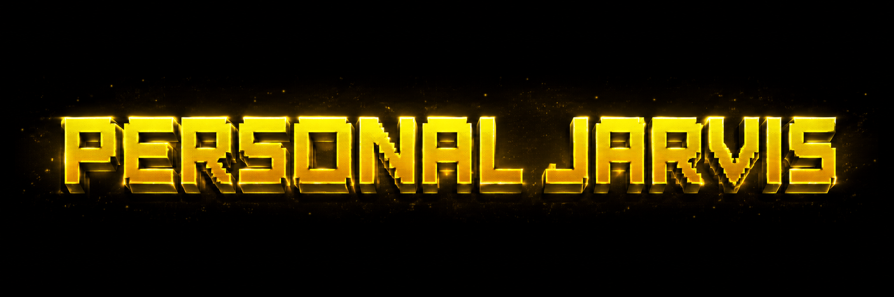
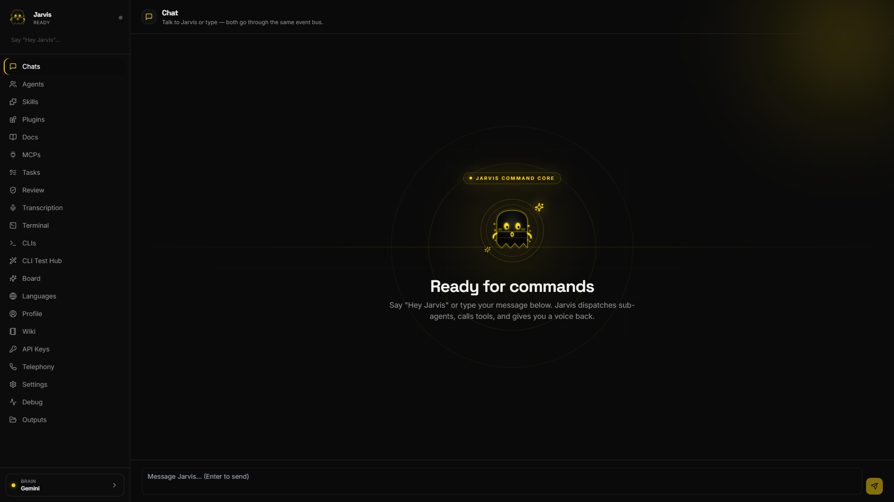
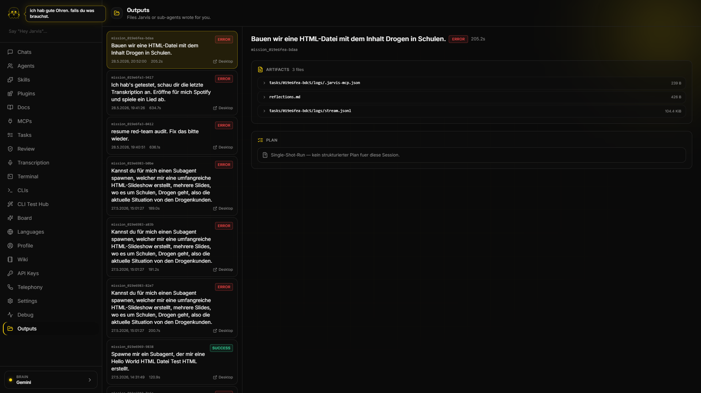
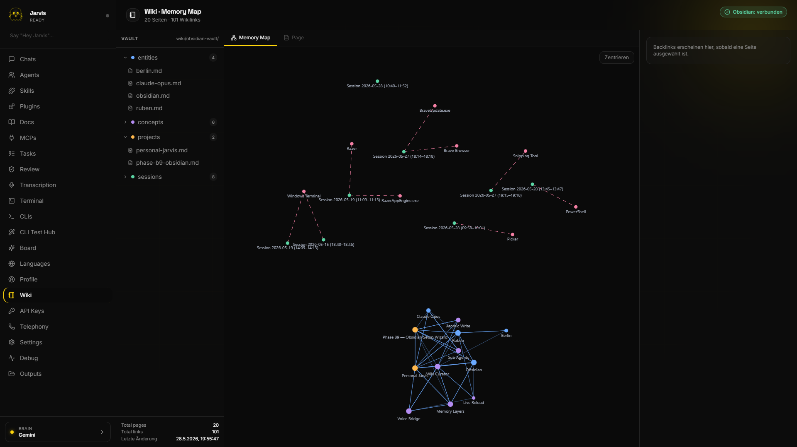

<p align="center">
  <a href="https://github.com/PersonalJarvis/PersonalJarvis">
    
  </a>
</p>

<p align="center">
  <a href="LICENSE"></a>
  <a href="https://discord.gg/UPu6pFWrJ"></a>
  <a href="https://x.com/PersonalJarvis"></a>
  
  
</p>

<p align="center">
  <b>A voice-driven meta-orchestrator that turns one spoken request into a fleet of self-checking AI agents.</b>
</p>

---

Personal Jarvis is not a classical voice assistant. At its core is a fast **Router-Brain**
that listens, decides, and *delegates* — dispatching heavy work to interchangeable agent
harnesses (Claude Code, Codex CLI, MCP servers, raw computer-use loops) that run in
isolation, review each other's output through a critic loop, and report back in your own
language. It is **provider-agnostic by design** (swap Gemini, Claude, GPT, Grok, or
OpenRouter with one setting), **self-modifying** (it can safely edit its own configuration
through an audited, reversible pipeline), and runs everywhere — from a headless server with
a browser UI to a full desktop with a tray app, an Orb overlay, and global-hotkey wake.

## Why it's different

- **The conversation never blocks.** A sub-second *Ack-Brain* acknowledges you while the
  deep brain is still thinking, so a spoken exchange stays one smooth, uninterrupted flow.
- **A meta-orchestrator, not a monolith.** A lean Router-Brain *dispatches* to specialized
  harnesses instead of trying to do everything in one prompt — the discipline that keeps it
  fast and lets it scale to heavy, multi-step work.
- **Self-healing Worker-Critic.** Background missions run in isolated `git worktree`
  branches; a critic loop reviews their work before you ever hear an answer, and a signed
  controller decides what gets spoken.
- **Provider-agnostic.** Gemini, Claude, OpenAI, Grok, OpenRouter — switch the brain by
  voice or config, with a smart, rate-limit-aware fallback chain. No single vendor lock-in.
- **Self-modifying, safely.** It can rewrite its own settings through a 10-step
  validate → backup → atomic-swap → reload → rollback → audit pipeline. Nothing is changed
  that can't be undone.
- **Memory that lasts.** A Knowledge Wiki long-term memory, an awareness layer, and a
  personal "knows-you" board build a deepening model of you across sessions.
- **Runs anywhere.** Linux, macOS, and Windows; a headless server speaking through the
  browser's mic and speakers, or a full voice-and-overlay desktop. Local-hardware features
  are opt-in extras that degrade gracefully when they're absent.

## Quick start

```bash
git clone https://github.com/PersonalJarvis/PersonalJarvis ~/personal-jarvis
cd ~/personal-jarvis

python -m venv .venv
source .venv/bin/activate          # Windows: .\.venv\Scripts\Activate.ps1

pip install -e . --no-deps          # activates the plugin entry-points
pip install -r requirements.txt     # runtime dependencies

python -m jarvis --wizard           # interactive first-run setup
```

The wizard walks you through hardware detection, API keys (stored in your OS credential
manager — never in the repo), microphone, and a wake word.

**Run it:**

```bash
# Full desktop: window + voice + Orb overlay
python -m jarvis.ui.web.launcher

# Headless server: API + WebSocket + browser UI, no local audio needed
python -m jarvis.ui.web.launcher --headless
```

Then open **http://localhost:47821** — the full Router-Brain → Worker-Critic →
Mission-Manager experience lives in the browser, including voice through the browser's
microphone. For a headless deployment, set your provider key (e.g. `GEMINI_API_KEY`) in the
environment or a `.env` file; the wizard detects the missing terminal and skips its prompts.

<p align="center">
  
</p>

## Architecture at a glance

Higher layers reach lower layers **only through protocols**; everything else talks over a
typed, immutable **EventBus**. That strict seam is what lets harnesses, providers, and
plugins be swapped without rippling through the codebase.

```
L7  UI/UX           Desktop app (FastAPI + React + pywebview), tray, Orb overlay
L6  Orchestrator    State machine, Router, BrainManager, Mission-Manager, Controller
L5  Harness adapter Claude Code, Codex, Open Interpreter, MCP, raw computer-use
L4  Brain           Gemini · Claude · OpenAI · Grok · OpenRouter  +  sub-second Ack-Brain
L3  Intent / Risk   Classifier, four-tier risk policy, approval, rate-limit tracking
L2  Speech          Wake → VAD → STT → TTS  (cloud or local, your choice)
L1  Audio I/O       Device routing, chime feedback
L0  OS / Hardware   Mic, speakers, global hotkeys, optional GPU
```

A deeper, exhaustive engineering map — anti-pattern register, recurring bug classes,
phase-by-phase status with `file:line` references — lives in the LLM context drop below.

## A guided tour

- **Missions & the Worker-Critic loop** — ask for something non-trivial and Jarvis spawns a
  background *mission*: an isolated worker does the work, a critic reviews it (up to three
  correction rounds), and a signed controller approves what's spoken. Every deliverable
  shows up in **Outputs** as a downloadable artifact.
- **Knowledge Wiki** — a long-term memory vault (Obsidian-compatible) Jarvis can search,
  read, and write back to, so it remembers people, projects, and facts across sessions.
- **Channels & telephony** — talk to Jarvis from the desktop, the browser, Telegram, or
  Discord; optional Twilio integration places real outbound calls.
- **Self-mod & skills** — Jarvis can adjust its own configuration safely and author new
  skills as reviewable drafts (never auto-activated).

<p align="center">
  
  
</p>

## Documentation

| Document | What's in it |
|---|---|
| [`CLAUDE.md`](CLAUDE.md) | Binding contributor guide — conventions, doctrine, anti-patterns |
| [`docs/PHILOSOPHY.md`](docs/PHILOSOPHY.md) | Cross-platform, provider-agnostic design doctrine |
| [`docs/BRAND.md`](docs/BRAND.md) | Brand guidelines — colors, typography, the wordmark |
| [`docs/openclaw-bridge.md`](docs/openclaw-bridge.md) | The agent-harness contract |
| [`docs/adr/`](docs/adr/) | Architecture Decision Records |
| [`docs/BUGS.md`](docs/BUGS.md) | The recurring-bug register |

> 🤖 **Working with an LLM on this codebase?** Paste
> [`docs/LLM-CONTEXT.md`](docs/LLM-CONTEXT.md) into a fresh chat — it's a dense,
> self-contained snapshot of the entire project, built for exactly that.

## Community

Come build with us — questions, ideas, and showcases all welcome.

<p align="center">
  <a href="https://discord.gg/UPu6pFWrJ"></a>
  <a href="https://x.com/PersonalJarvis"></a>
</p>

- **Discord** — [discord.gg/UPu6pFWrJ](https://discord.gg/UPu6pFWrJ)
- **X** — [@PersonalJarvis](https://x.com/PersonalJarvis) · [@Alex_Sample](https://x.com/Alex_Sample)
- **Instagram** — [@personaljarvis](https://www.instagram.com/personaljarvis/)
- **GitHub** — [PersonalJarvis/PersonalJarvis](https://github.com/PersonalJarvis/PersonalJarvis)

## Sponsors & supporters

Personal Jarvis is independent and self-funded. If it saves you time, or you just like
where it's headed, sponsorship keeps the lights on and the roadmap moving — and goes
straight into provider costs, infrastructure, and development time.

<p align="center">
  <a href="https://github.com/sponsors/PersonalJarvis"></a>
</p>

<p align="center">
  <i>This wall is empty — for now.</i><br/>
  <a href="https://github.com/sponsors/PersonalJarvis"><b>Become the first sponsor →</b></a>
</p>

| Tier | You get |
|---|---|
| **Backer** | Your name in this README + a supporter role on Discord |
| **Supporter** | The above + a link to your project or profile |
| **Sponsor** | The above + your logo on the sponsor wall |
| **Partner** | The above + a seat at the roadmap table |

> Sponsorship is being set up. Want to talk before the page is live? Reach out on
> [Discord](https://discord.gg/UPu6pFWrJ) or [X](https://x.com/PersonalJarvis).

## Contributing

Pull requests are welcome. A few house rules keep the project coherent:

- **Artifacts are English** — code, comments, docs, and commit messages. (Conversation can
  be any language; the assistant speaks de/en/es at runtime.)
- Read [`CLAUDE.md`](CLAUDE.md) and [`docs/PHILOSOPHY.md`](docs/PHILOSOPHY.md) before larger
  changes — they're the binding conventions and the cross-platform doctrine.
- New providers must pass the contract test suite (`pytest tests/contract/`).

## License

Released under the **MIT License** — free to use, modify, and distribute, including
commercially, provided the copyright notice is preserved. See [`LICENSE`](LICENSE) for the
full text, the attribution clause, and the third-party notices.

<br/>

<p align="center">
  <sub>Built by the Personal Jarvis Maintainers · © 2026 · MIT</sub><br/>
  <sub><a href="https://discord.gg/UPu6pFWrJ">Discord</a> · <a href="https://x.com/PersonalJarvis">X</a> · <a href="https://www.instagram.com/personaljarvis/">Instagram</a></sub>
</p>
