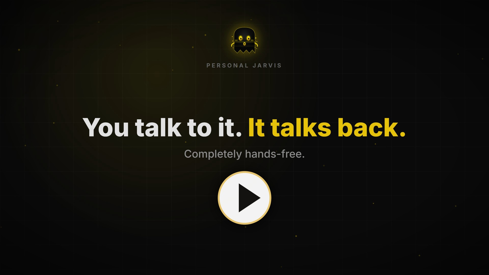

<p align="center">
  <a href="https://github.com/PersonalJarvis/PersonalJarvis">
    
  </a>
</p>

<p align="center">
  <a href="LICENSE"></a>
  <a href="https://discord.gg/UPu6pFWrJ"></a>
  <a href="https://x.com/PersonalJarvis"></a>
  
  
</p>

<p align="center">
  <b>Talk to your computer — and watch it do the work: an open-source, privacy-first voice agent with full command of your PC.</b>
</p>

<!--
  Hero = click-to-play poster linking to the onboarding video on YouTube. The video is
  NOT committed to the source tree, so a `git clone` never pulls it — only this ~100 KB
  poster ships; clicking it opens the video on YouTube (which GitHub can't embed inline).
  Refresh the poster: replace assets/demo/demo-poster.jpg (keep width≈820)
  Video: https://www.youtube.com/watch?v=FXz1HclXL1g
-->
<p align="center">
  <a href="https://www.youtube.com/watch?v=FXz1HclXL1g">
    
  </a>
</p>

---

Personal Jarvis is not a classical voice assistant. At its core is a fast **Router-Brain**
that listens, decides, and *delegates* — dispatching heavy work to interchangeable agent
harnesses (Claude Code, Codex CLI, MCP servers, raw computer-use loops) that run in
isolation, review each other's output through a critic loop, and report back in your own
language. It is **provider-agnostic by design** (swap Gemini, Claude, OpenAI, or
OpenRouter with one setting), **self-modifying** (it can safely edit its own configuration
through an audited, reversible pipeline), and runs everywhere — from a headless server with
a browser UI to a full desktop with a tray app, an Orb overlay, and global-hotkey wake.

## What do you actually say to it?

You talk to it the way you'd hand a task to a capable assistant — then it goes and does
it. A few things it can do today:

- **"Research the best open-source vector databases and drop a comparison in my Outputs."**
  → spawns a background mission: a worker does the digging, a critic checks the work, and
  you get a downloadable write-up in **Outputs**.
- **"Read the README in my current project and summarize it in three sentences."**
  → a file-aware worker opens the files, reads them, and reports back.
- **"Open my browser and pull up the weather in Berlin."**
  → drives the screen directly through computer-use — real clicks and keystrokes, not a
  canned integration.
- **"Call the clinic on Main Street and ask for their next open appointment."**
  → places a real outbound phone call through the optional Twilio integration.
- **"Remember that Alex prefers Signal over email."**
  → writes the fact to the Knowledge Wiki so it sticks across every future session.
- **"When the download finishes, ping me on Telegram."**
  → sets a when-this-then-that trigger and reaches you on your channel when it fires.

## Why it's different

| | |
|---|---|
| **Never blocks** | A sub-second Ack-Brain replies while the deep brain still thinks. |
| **Meta-orchestrator** | A lean Router dispatches to specialized harnesses, not one giant prompt. |
| **Self-healing** | Missions run in isolated worktrees; a critic reviews before you hear it. |
| **Provider-agnostic** | Gemini, Claude, OpenAI, OpenRouter — switch by voice, smart fallback. |
| **Your plan or key** | Run agents on a subscription login or a pay-per-token key. |
| **Self-modifying** | Rewrites its own settings through a reversible, audited pipeline. |
| **Lasting memory** | A Knowledge Wiki + awareness build a model of you across sessions. |
| **Runs anywhere** | Headless Linux server to full voice desktop; local parts degrade. |

## Requirements

You need exactly **three** things on your machine before you install. The installer checks for
all three up front and stops with a download link if any is missing — nothing else is mandatory.

| Required | Version | Why it's needed |
|---|---|---|
| **Python** | 3.11 or newer | The application runs on Python. |
| **Git** | any recent release | Fetches the project and runs background missions in isolated worktrees. |
| **Node.js** | 18 or newer | Runs the agent CLIs the worker delegates heavy missions to (Claude Code, Codex) and a few Node-based integrations. *(Not needed on the `--headless` cloud-only server path.)* |

Everything below is **optional** — each item only unlocks a specific feature, and Personal
Jarvis runs without it:

| Optional | Unlocks |
|---|---|
| A provider **API key or subscription login** — Gemini, Claude, OpenAI, or OpenRouter | Actually talking to a brain. Bring your own; nothing is bundled. The app's one-time setup guide stores it in your OS credential manager. |
| **libportaudio** *(Linux only)* | Local microphone and speakers (`apt install libportaudio2`). Not needed for the headless / browser-audio path. |
| A **GPU** | Faster fully-offline speech. The local voice models install by default and run on CPU everywhere; a GPU only speeds them up. Cloud speech needs none of this. |

## Install

One command on **Windows, macOS, or Linux** — no Docker, no Python-version archaeology. It
installs the **full profile**: everything in this repository (desktop app, telephony, chat
channels, local voice models incl. the offline wake word and Whisper), skipping only what
your OS cannot run. It asks **nothing** in the terminal and launches the app as its last
step. The app then walks you through a one-time setup guide (language, wake word, API
keys) — it never shows again, not even after updates. **Bring your own keys**; nothing is
bundled.

**Windows** — PowerShell

```powershell
irm https://raw.githubusercontent.com/PersonalJarvis/PersonalJarvis/main/install/install.ps1 | iex
```

**macOS · Linux**

```bash
curl -fsSL https://raw.githubusercontent.com/PersonalJarvis/PersonalJarvis/main/install/install.sh | bash
```

> Open source — read the installer before you run it. It only creates a venv, installs
> dependencies, prefetches the voice models, and launches the app. All setup (API keys —
> stored in your OS credential manager, never in the repo — wake word, language) happens
> in the app itself, once. Re-running the same one-liner updates in place and keeps your setup.

| Install flag | Effect |
|---|---|
| `--headless` | Minimal server install (advanced): API + WebSocket only, torch-free base, no Node.js required — the tiny-VPS path |
| `--no-launch` | Install only; don't start the app |

**Uninstall** — one command removes everything a plain folder-delete would miss: the
install folder, the login-autostart entry, and the API keys saved in your OS keychain.
Add `--dry-run` to preview, or `--yes` to skip the confirmation.

```powershell
# Windows (PowerShell)
& "$env:USERPROFILE\.personal-jarvis\install\uninstall.ps1"
```

```bash
# macOS · Linux
bash ~/.personal-jarvis/install/uninstall.sh
```

<details>
<summary><b>Prefer pipx, or a manual clone?</b></summary>

<br/>

**pipx** — isolated, no clone, any OS:

```bash
pipx install "git+https://github.com/PersonalJarvis/PersonalJarvis" && jarvis serve
```

**Manual** — clone it, read every line, then run:

```bash
git clone https://github.com/PersonalJarvis/PersonalJarvis
cd PersonalJarvis
python -m venv .venv && source .venv/bin/activate   # Windows: .\.venv\Scripts\Activate.ps1
pip install -e .[full]
jarvis serve
```

</details>

## Run it

The one-liner launches the app for you. To start it again later:

```bash
jarvis          # full desktop: window + voice + Orb overlay
jarvis serve    # headless server: API + WebSocket + browser UI, no local audio needed
```

Then open **http://localhost:47821** — the full Router-Brain → Worker-Critic →
Mission-Manager experience lives in the browser, including voice through the browser's
microphone. On a headless deployment the same one-time setup guide runs in the browser; you
can also set a provider key (e.g. `GEMINI_API_KEY`) in the environment or a `.env` file.

<p align="center">
  
</p>

## Architecture at a glance

Higher layers reach lower layers **only through protocols**; everything else talks over a
typed, immutable **EventBus**. That strict seam is what lets harnesses, providers, and
plugins be swapped without rippling through the codebase.

```
L7  UI/UX           Desktop app (FastAPI + React + pywebview), tray, Orb overlay
L6  Orchestrator    State machine, Router, BrainManager, Mission-Manager, Controller
L5  Harness adapter Claude Code, Codex, Open Interpreter, MCP, raw computer-use
L4  Brain           Gemini · Claude · OpenAI · Grok · OpenRouter  +  sub-second Ack-Brain
L3  Intent / Risk   Classifier, four-tier risk policy, approval, rate-limit tracking
L2  Speech          Wake → VAD → STT → TTS  (cloud or local, your choice)
L1  Audio I/O       Device routing, chime feedback
L0  OS / Hardware   Mic, speakers, global hotkeys, optional GPU
```

A deeper, exhaustive engineering map — anti-pattern register, recurring bug classes,
phase-by-phase status with `file:line` references — lives in the LLM context drop below.

## Project structure

A quick map of the repository so you know where everything lives:

```text
PersonalJarvis/
├── jarvis/          # The application — every core package (brain, speech, missions, memory, UI server…)
├── ui/              # Orb overlay for the desktop; loaded by jarvis at runtime
├── OS-Level/        # Edge-glow overlay process — action border, mascot, cursor trail
├── board-backend/   # Standalone federation service (verifies signed Board aggregates)
├── conductor/       # YAML-first agentic-workflow canvas, mounted inside the app
├── wiki/            # Seed knowledge vault (Obsidian-compatible), created on first run
├── install/         # One-line installers + signed-release verification (cosign / TUF)
├── tests/           # Unit, integration, contract, and end-to-end suites
├── docs/            # Architecture docs, ADRs, the philosophy, design specs
├── assets/          # Brand art, banner, screenshots
├── .github/         # CI workflows + issue / pull-request templates
├── scoop-bucket/    # Windows install manifest (Scoop)
├── homebrew-tap/    # macOS install formula (Homebrew)
└── README · LICENSE · CODE_OF_CONDUCT · CONTRIBUTING · SECURITY · CHANGELOG
```

Inside `jarvis/`, the layout mirrors the 8-layer model above — `jarvis/brain/`
(providers + router), `jarvis/speech/` (wake → VAD → STT → TTS), `jarvis/missions/`
(the self-healing Worker-Critic), `jarvis/memory/wiki/` (long-term memory), and
`jarvis/ui/web/` (the FastAPI + React desktop app).

## A guided tour

- **Missions & the Worker-Critic loop** — ask for something non-trivial and Jarvis spawns a
  background *mission*: an isolated worker does the work, a critic reviews it (up to three
  correction rounds), and a signed controller approves what's spoken. Every deliverable
  shows up in **Outputs** as a downloadable artifact.
- **Knowledge Wiki** — a long-term memory vault (Obsidian-compatible) Jarvis can search,
  read, and write back to, so it remembers people, projects, and facts across sessions.
- **Channels & telephony** — talk to Jarvis from the desktop, the browser, Telegram, or
  Discord; optional Twilio integration places real outbound calls.
- **Self-mod & skills** — Jarvis can adjust its own configuration safely and author new
  skills as reviewable drafts (never auto-activated).

<!-- Wiki screenshot removed 2026-07-07: the previous capture showed a live
     personal vault (privacy review finding). Re-add once a staged demo-vault
     screenshot exists. -->

## Documentation

| Document | What's in it |
|---|---|
| [`CLAUDE.md`](CLAUDE.md) | Binding contributor guide — conventions, doctrine, anti-patterns |
| [`docs/PHILOSOPHY.md`](docs/PHILOSOPHY.md) | Cross-platform, provider-agnostic design doctrine |
| [`docs/BRAND.md`](docs/BRAND.md) | Brand guidelines — colors, typography, the wordmark |
| [`docs/adr/`](docs/adr/) | Architecture Decision Records |
| [`docs/BUGS.md`](docs/BUGS.md) | The recurring-bug register |

> 🤖 **Working with an LLM on this codebase?** Paste
> [`docs/LLM-CONTEXT.md`](docs/LLM-CONTEXT.md) into a fresh chat — it's a dense,
> self-contained snapshot of the entire project, built for exactly that.

## Community

Come build with us — questions, ideas, and showcases all welcome.

<p align="center">
  <a href="https://discord.gg/UPu6pFWrJ"></a>
  <a href="https://x.com/PersonalJarvis"></a>
</p>

- **Discord** — [discord.gg/UPu6pFWrJ](https://discord.gg/UPu6pFWrJ)
- **X** — [@PersonalJarvis](https://x.com/PersonalJarvis) · [@Ruben_Herz](https://x.com/Ruben_Herz)
- **Instagram** — [@personaljarvis](https://www.instagram.com/personaljarvis/)
- **GitHub** — [PersonalJarvis/PersonalJarvis](https://github.com/PersonalJarvis/PersonalJarvis)

## Sponsors & supporters

Personal Jarvis is independent and self-funded. If it saves you time, or you just like
where it's headed, sponsorship keeps the lights on and the roadmap moving — and goes
straight into provider costs, infrastructure, and development time.

<p align="center">
  <a href="https://github.com/sponsors/PersonalJarvis"></a>
</p>

<p align="center">
  <i>This wall is empty — for now.</i><br/>
  Want to be the first? Reach out on <a href="https://discord.gg/UPu6pFWrJ">Discord</a> or <a href="https://x.com/PersonalJarvis">X</a>.
</p>

| Tier | You get |
|---|---|
| **Backer** | Your name in this README + a supporter role on Discord |
| **Supporter** | The above + a link to your project or profile |
| **Sponsor** | The above + your logo on the sponsor wall |
| **Partner** | The above + a seat at the roadmap table |

> Sponsorship is being set up. Want to talk before the page is live? Reach out on
> [Discord](https://discord.gg/UPu6pFWrJ) or [X](https://x.com/PersonalJarvis).

## Contributing

Pull requests are welcome — see **[`CONTRIBUTING.md`](CONTRIBUTING.md)** for the full guide
(dev setup, architecture, the plugin-vs-tool-vs-skill decision, and the PR checklist). The
short version:

- **Artifacts are English** — code, comments, docs, and commit messages. (Conversation can
  be any language; the assistant speaks de/en/es at runtime.)
- Read [`CLAUDE.md`](CLAUDE.md) and [`docs/PHILOSOPHY.md`](docs/PHILOSOPHY.md) before larger
  changes — the binding conventions and the cross-platform doctrine.
- New providers must pass the contract test suite (`pytest tests/contract/`).
- Found a security issue? Please report it privately — see [`SECURITY.md`](SECURITY.md).

## Author

Personal Jarvis is created and maintained by **Ruben Herz**.
Say hi on X — [@Ruben_Herz](https://x.com/Ruben_Herz).

## License

Released under the **MIT License** — free to use, modify, and distribute, including
commercially, provided the copyright notice is preserved. See [`LICENSE`](LICENSE) for the
full text, the attribution clause, and the third-party notices.

**Trademarks.** Product, provider, and integration names and logos shown here are
trademarks of their respective owners and are used only to identify the services they refer
to. Personal Jarvis is not affiliated with or endorsed by any of them — see
[`TRADEMARK.md`](TRADEMARK.md).

<br/>

<p align="center">
  <sub>Created by <b>Ruben Herz</b> · <a href="https://x.com/Ruben_Herz">@Ruben_Herz</a> · © 2026 · MIT</sub><br/>
  <sub><a href="https://discord.gg/UPu6pFWrJ">Discord</a> · <a href="https://x.com/PersonalJarvis">X</a> · <a href="https://www.instagram.com/personaljarvis/">Instagram</a></sub>
</p>
