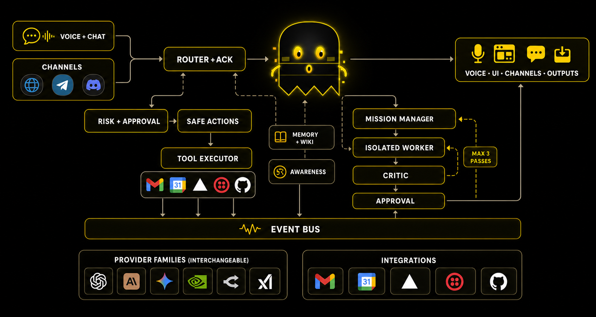
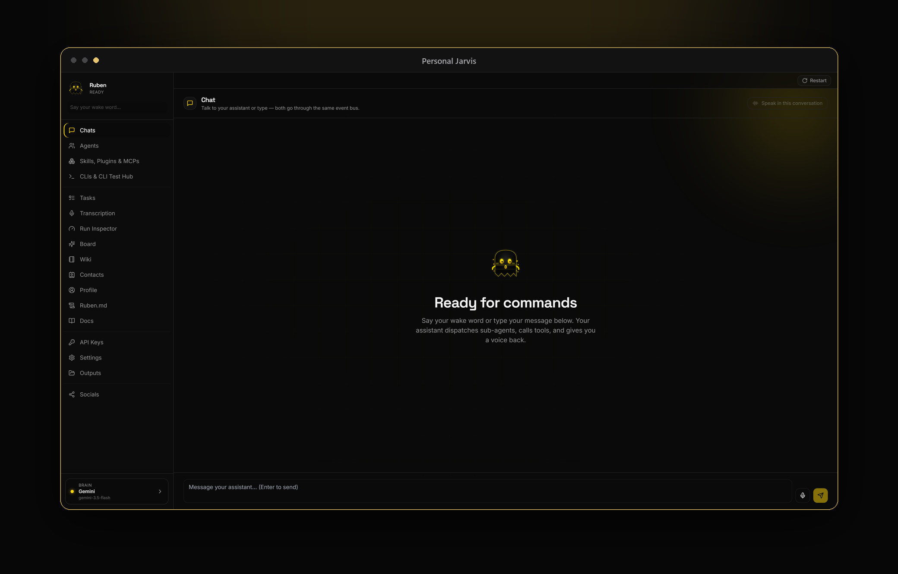

<p align="center">
  <a href="https://github.com/PersonalJarvis/PersonalJarvis">
    
  </a>
</p>

<p align="center">
  <a href="LICENSE"></a>
  <a href="https://discord.gg/x7USduHxbc"></a>
  <a href="https://x.com/Ruben_Luetke"></a>
  <a href="https://personaljarvis.ai/"></a>
  
  
</p>

<p align="center">
  <b>Talk to your computer — and watch it do the work: an open-source, privacy-first voice agent with full command of your PC.</b>
</p>

---

Not a classical voice assistant: a fast **Router-Brain** listens, decides, and *delegates* —
heavy work goes to interchangeable agent harnesses (Claude Code, Codex CLI, MCP,
computer-use) that run isolated, get reviewed by a critic, and report back in your language.
**Provider-agnostic** (Gemini, Claude, OpenAI, OpenRouter — one setting), **self-modifying**,
and it runs everywhere — headless server to full voice desktop.

## Just say it

| You say | What happens |
|---|---|
| *"Research vector databases."* | An isolated agent digs in; the finished report lands as a download in **Outputs**. |
| *"Call the clinic and book the next open appointment."* | A real outbound phone call goes out through the optional Twilio line. |
| *"Remember: Alex prefers Signal over email."* | Written to the Knowledge Wiki — still known in every future session. |
| *"When the download finishes, ping me on Telegram."* | A when-then trigger arms itself and messages you the moment it fires. |
| *"Open the browser and pull up the weather."* | Jarvis takes mouse and keyboard and does it on your screen. |

Every one of these works today, out of the box.

## See it in action

<p align="center">
  <a href="https://www.youtube.com/watch?v=6xoxgNu5fd8">
    
  </a>
</p>

<p align="center">
  <sub>One voice command, and the Router-Brain takes the screen and does it live &middot; <a href="https://www.youtube.com/watch?v=6xoxgNu5fd8">watch the full demo on YouTube</a></sub>
</p>

## Why it's different

| | |
|---|---|
| **Never blocks** | A sub-second Ack-Brain replies while the deep brain still thinks. |
| **Meta-orchestrator** | A lean Router dispatches to specialized harnesses, not one giant prompt. |
| **Self-healing** | Missions run in isolated worktrees; a critic reviews before you hear it. |
| **Provider-agnostic** | Gemini, Claude, OpenAI, OpenRouter — switch by voice, smart fallback. |
| **Your plan or key** | Run agents on a subscription login or a pay-per-token key. |
| **Self-modifying** | Rewrites its own settings through a reversible, audited pipeline. |
| **Lasting memory** | A Knowledge Wiki + awareness build a model of you across sessions. |
| **Runs anywhere** | Headless Linux server to full voice desktop; local parts degrade. |

## How it works



Higher layers reach lower layers **only through protocols**; everything else talks over a
typed, immutable **EventBus** — that strict seam is what lets harnesses, providers, and
plugins be swapped freely.

<details>
<summary><b>The 8-layer map</b></summary>

```
L7  UI/UX           Desktop app (FastAPI + React + pywebview), tray, Orb overlay
L6  Orchestrator    State machine, Router, BrainManager, Mission-Manager, Controller
L5  Harness adapter Claude Code, Codex, Open Interpreter, MCP, raw computer-use
L4  Brain           Gemini · Claude · OpenAI · Grok · OpenRouter  +  sub-second Ack-Brain
L3  Intent / Risk   Classifier, four-tier risk policy, approval, rate-limit tracking
L2  Speech          Wake → VAD → STT → TTS  (cloud or local, your choice)
L1  Audio I/O       Device routing, chime feedback
L0  OS / Hardware   Mic, speakers, global hotkeys, optional GPU
```

A deeper engineering map — anti-patterns, bug classes, phase status with `file:line`
references — lives in [`docs/LLM-CONTEXT.md`](docs/LLM-CONTEXT.md).

</details>

## Install

One command on **Windows, macOS, or Linux**. You need **Python 3.11+** and **Git** — the
installer checks both and stops with a download link if one is missing. It asks nothing in
the terminal, launches the app, and the app walks you through a one-time setup (language,
wake word, API keys). **Bring your own keys**; nothing is bundled.

**Windows** — PowerShell

```powershell
irm https://raw.githubusercontent.com/PersonalJarvis/PersonalJarvis/main/install/install.ps1 | iex
```

**macOS · Linux**

```bash
curl -fsSL https://raw.githubusercontent.com/PersonalJarvis/PersonalJarvis/main/install/install.sh | bash
```

> Open source — read the installer before you run it. It only creates a venv, installs
> dependencies, prefetches the voice models, and launches the app. Keys land in your OS
> credential manager, never in the repo. Re-running the same one-liner updates in place.

**Uninstall** — one command as well. Removes the install folder, the autostart entry, and
the keychain entries; add `--dry-run` to preview, `--yes` to skip the confirmation:

```powershell
# Windows (PowerShell)
& "$env:USERPROFILE\.personal-jarvis\install\uninstall.ps1"
```

```bash
# macOS · Linux
bash ~/.personal-jarvis/install/uninstall.sh
```

Both run the uninstaller **that is already on your disk**. If it is missing or
refuses to start — installs from 1.1.0 / 1.1.1 shipped one that could not run on
macOS at all — skip it and use the app's own uninstall directly. Same job, no
bootstrap involved; add `--dry-run` first to see what it would remove:

```bash
# macOS · Linux
~/.personal-jarvis/.venv/bin/python -m jarvis --uninstall
```

```powershell
# Windows (PowerShell)
& "$env:USERPROFILE\.personal-jarvis\.venv\Scripts\python.exe" -m jarvis --uninstall
```

<details>
<summary><b>Optional extras, install flags, pipx & manual clone</b></summary>

<br/>

Everything below is optional — each item only unlocks a specific feature:

| Optional | Unlocks |
|---|---|
| A provider **API key or subscription login** — Gemini, Claude, OpenAI, or OpenRouter | Actually talking to a brain. The in-app setup stores it in your OS credential manager. |
| **Node.js 18+** | The coding-agent worker CLIs (Claude Code, Codex) heavy missions delegate to. Add it any time. |
| **libportaudio** *(Linux only)* | Local microphone and speakers (`apt install libportaudio2`). |
| A **GPU** | Faster fully-offline speech; everything also runs on CPU. |

| Install flag | Effect |
|---|---|
| `--headless` | Minimal server install: API + WebSocket only, torch-free base, no Node.js — the tiny-VPS path |
| `--no-launch` | Install only; don't start the app |

**pipx** — isolated, no clone, any OS:

```bash
pipx install "git+https://github.com/PersonalJarvis/PersonalJarvis" && jarvis serve
```

**Manual** — clone it, read every line, then run:

```bash
git clone https://github.com/PersonalJarvis/PersonalJarvis
cd PersonalJarvis
python -m venv .venv && source .venv/bin/activate   # Windows: .\.venv\Scripts\Activate.ps1
pip install -e .[full]
jarvis serve
```

</details>

## Run it

```bash
jarvis          # full desktop: window + voice + Orb overlay
jarvis serve    # headless server: API + WebSocket + browser UI, no local audio needed
```

<p align="center">
  
</p>

<details>
<summary><b>Headless / server notes</b></summary>

<br/>

On a server, open **http://localhost:47821** — the full experience lives in the browser,
including voice through the browser microphone. The one-time setup runs there too; you can
also set a provider key (e.g. `GEMINI_API_KEY`) in the environment or a `.env` file.

Browser microphone access needs a secure context: `localhost` works as-is; for a remote
VPS, terminate TLS with an HTTPS reverse proxy (Caddy, Nginx) — plain `http://server-ip`
stays usable for text, but browsers block voice.

</details>

## What's inside

**Missions — the self-healing work loop.** Anything non-trivial ("research X and
write me a report") spawns a worker in an isolated `git worktree` — a private
sandbox copy of the workspace, with crash containment. A critic reviews the
result (up to three rounds) before you ever hear it; deliverables land in
**Outputs** as downloadable files.

**Knowledge Wiki — memory that survives.** An Obsidian-compatible Markdown vault
Jarvis reads and writes. Tell it something once and every future session knows.
It's plain files on your disk — read it, edit it, sync it, own it.

**Computer use.** Jarvis takes the mouse and keyboard when you ask: open apps,
click, type, navigate — with an on-screen action border so you always see when
it's driving.

**Channels & telephony.** Desktop window, browser, Telegram, and Discord all
reach the same brain and share the same memory. Optional Twilio integration
makes real outbound phone calls.

**Safety tiers.** Every action is classified **safe / monitor / ask / block**
before it runs — destructive things ask first, whitelisted routines stop nagging
you, and the blacklist always outranks the whitelist.

**Self-modification.** It can change its own settings by voice — through a
guarded pipeline (validate → backup → apply → verify → roll back on failure)
with a full audit trail. Generated skills always land as *drafts* for your
review; nothing self-activates.

**Realtime voice.** Optional speech-to-speech mode (OpenAI Realtime, Gemini
Live) for sub-second conversational latency — with automatic fallback to the
classic wake → STT → brain → TTS pipeline when it's unavailable.

## Drive it from the terminal

The `jarvis` CLI (aliases `jarvisctl`, `jctl`) controls a **running** instance —
the same actions as the app, behind the same safety checks, just scriptable.
Anything you can click, you (or your scripts, or another coding agent) can type:

```bash
jarvis system status          # {"reachable": true} when Jarvis is up
jarvis --json brain status    # which provider is live, as machine-readable JSON
jarvis api <tag> <op>         # EVERY REST endpoint, auto-generated from OpenAPI
```

It's a thin client over the local REST API (`127.0.0.1:47821`), so it inherits
every guardrail — risk tiers, atomic config writes, the audit log — rather than
bypassing them. Full guide: [`docs/jarvis-cli.md`](docs/jarvis-cli.md).

## Configuration

Zero config files needed — every setting has a built-in default and the one-time
in-app setup covers the rest. For fine control there's one optional, documented
file ([`jarvis.toml.example`](jarvis.toml.example)):

```toml
[profile]
language = "auto"          # de | en | auto — bilingual auto-detect

[trigger.wake_word]
phrase = ""                # YOUR word — nothing is preset for you
engine = "auto"            # resolves the best engine for your phrase

[stt]
provider = "groq-api"      # or openai-api, openrouter-stt, deepgram-…

[tts]
provider = "gemini-flash-tts"
fallback = "grok-voice"    # cross-provider fallback is the norm everywhere
```

Overrides cascade `jarvis.toml → ENV` (`JARVIS__SECTION__KEY=…`). **Secrets
never go in this file** — API keys live in your OS credential manager (or
`.env`), entered in-app.

## Privacy

- **Keys stay yours** — stored in the OS credential manager, never in the repo, never in a file you could accidentally commit.
- **The always-on part is local** — wake-word listening runs entirely on your machine; audio only goes to a cloud STT provider *after* you've addressed Jarvis, and only if you chose a cloud provider.
- **Local per stage, your choice** — speech recognition can run fully offline (`[local-voice]` extra); brain and voice output use whichever provider you configure.
- **Memory is plain files** — the Knowledge Wiki is Markdown on your disk, not a hosted database.

## Extend it

Every pluggable part is a Python **entry point**: write a class against the
protocols in [`jarvis/core/protocols.py`](jarvis/core/protocols.py), register
one line in `pyproject.toml`, reinstall — no fork, no core edits.

| Plugin group | What you can add |
|---|---|
| `jarvis.brain` | A new LLM provider |
| `jarvis.stt` / `jarvis.tts` | Speech recognition / synthesis backends |
| `jarvis.wakeword` | Wake-word engines |
| `jarvis.realtime` | Speech-to-speech providers |
| `jarvis.harness` | Agent harnesses missions delegate to |
| `jarvis.tool` | Actions the router can call directly |
| `jarvis.channel` | New surfaces — chat platforms, transports |

Three rules keep it stable: implement the protocol, stream everything
(`AsyncIterator` — non-streaming yields one element), and pass the contract
suite (`pytest tests/contract/`). The deep engineering map — anti-patterns,
recurring bug classes, phase status — lives in
[`docs/LLM-CONTEXT.md`](docs/LLM-CONTEXT.md), built to be pasted into an LLM
chat whole.

<details>
<summary><b>Project structure</b></summary>

```text
PersonalJarvis/
├── jarvis/          # The application — every core package (brain, speech, missions, memory, UI server…)
├── ui/              # Orb overlay for the desktop; loaded by jarvis at runtime
├── OS-Level/        # Edge-glow overlay process — action border, mascot, cursor trail
├── board-backend/   # Standalone federation service (verifies signed Board aggregates)
├── conductor/       # YAML-first agentic-workflow canvas, mounted inside the app
├── wiki/            # Seed knowledge vault (Obsidian-compatible), created on first run
├── install/         # One-line installers + signed-release verification (cosign / TUF)
├── tests/           # Unit, integration, contract, and end-to-end suites
├── docs/            # Architecture docs, ADRs, the philosophy, design specs
├── assets/          # Brand art, banner, screenshots
├── .github/         # CI workflows + issue / pull-request templates
├── scoop-bucket/    # Windows install manifest (Scoop)
├── homebrew-tap/    # macOS install formula (Homebrew)
└── README · LICENSE · CODE_OF_CONDUCT · CONTRIBUTING · SECURITY · CHANGELOG
```

Inside `jarvis/`, the layout mirrors the 8-layer model — `jarvis/brain/` (providers +
router), `jarvis/speech/` (wake → VAD → STT → TTS), `jarvis/missions/` (the self-healing
Worker-Critic), `jarvis/memory/wiki/` (long-term memory), `jarvis/ui/web/` (the desktop app).

</details>

## Documentation

| Document | What's in it |
|---|---|
| [`docs/architecture-overview.md`](docs/architecture-overview.md) | The full architecture — layers, module catalog, data flow |
| [`docs/LLM-CONTEXT.md`](docs/LLM-CONTEXT.md) | Dense project snapshot, built to paste into an LLM chat whole |
| [`CLAUDE.md`](CLAUDE.md) | Binding contributor guide — conventions, doctrine, anti-patterns |
| [`docs/PHILOSOPHY.md`](docs/PHILOSOPHY.md) | Cross-platform, provider-agnostic design doctrine |
| [`docs/adr/`](docs/adr/) | Architecture Decision Records |
| [`docs/BUGS.md`](docs/BUGS.md) | The recurring-bug register |
| [`docs/BRAND.md`](docs/BRAND.md) | Brand guidelines — colors, typography, the wordmark |

## Community

Personal Jarvis is built in the open — the roadmap, the bug hunts, and the wins all land
on Discord first. Come say hi and help shape where it goes.

<p align="center">
  <a href="https://discord.gg/x7USduHxbc"></a>
  <a href="https://x.com/Ruben_Luetke"></a>
</p>

<p align="center">
  <a href="https://discord.gg/x7USduHxbc">Discord</a> ·
  <a href="https://x.com/Ruben_Luetke">@Ruben_Luetke</a> ·
  <a href="https://www.instagram.com/personaljarvis/">Instagram</a> ·
  <a href="https://github.com/PersonalJarvis/PersonalJarvis">GitHub</a>
</p>

## Contributing

Pull requests are welcome — **[`CONTRIBUTING.md`](CONTRIBUTING.md)** has the full guide.
The short version: artifacts are English, read [`CLAUDE.md`](CLAUDE.md) before larger
changes, new providers must pass `pytest tests/contract/`, and security issues go to
[`SECURITY.md`](SECURITY.md) privately.

## License

**MIT** — free to use, modify, and distribute, including commercially; see
[`LICENSE`](LICENSE). Third-party names and logos belong to their owners —
see [`TRADEMARK.md`](TRADEMARK.md).

<br/>

<p align="center">
  <sub>Created by <b>Ruben Lütke</b> · <a href="https://x.com/Ruben_Luetke">@Ruben_Luetke</a> · © 2026 · MIT</sub><br/> <!-- i18n-allow: maintainer's name, not German prose -->
  <sub><a href="https://discord.gg/x7USduHxbc">Discord</a> · <a href="https://x.com/Ruben_Luetke">X</a> · <a href="https://www.instagram.com/personaljarvis/">Instagram</a></sub>
</p>
