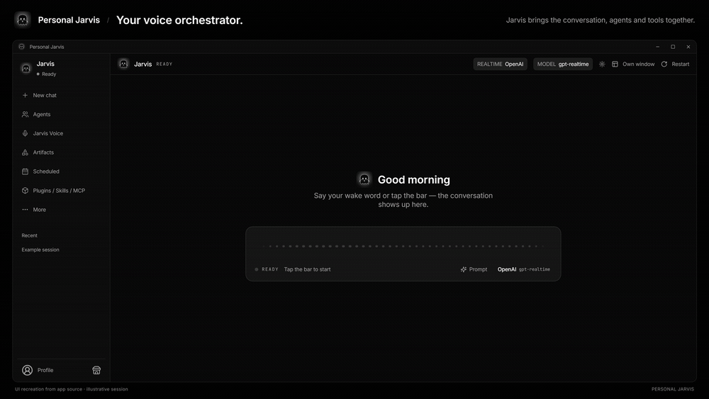
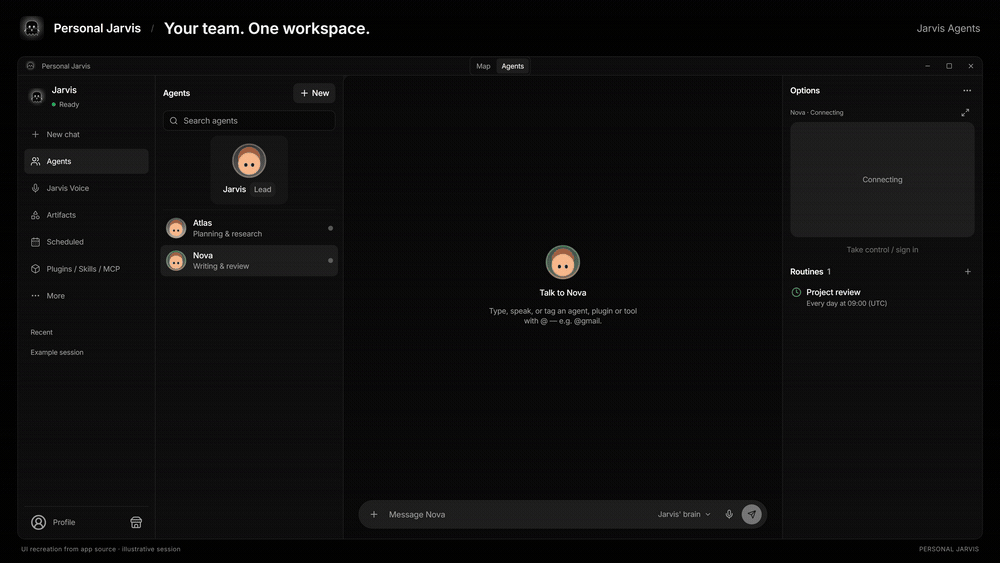
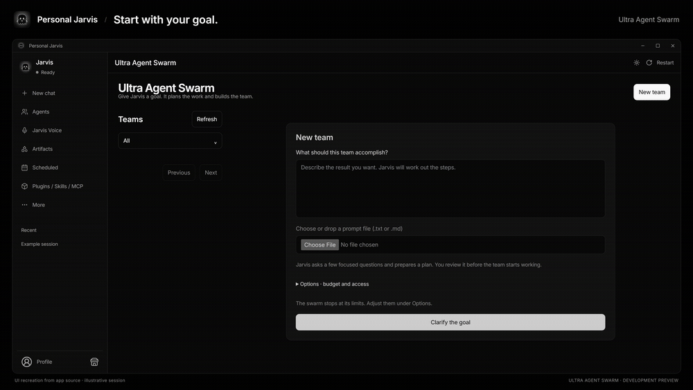

<p align="center">
  
</p>

<h2 align="center">The voice orchestrator for your AI workspace.</h2>

<p align="center">
  Talk to Jarvis. Work with your agents. Coordinate a swarm.<br />
  One desktop app for conversations, agent teams, tools, and the work they produce.
</p>

<p align="center">
  <a href="https://pypi.org/project/personal-jarvis/"></a>
  <a href="LICENSE"></a>
  <a href="https://discord.gg/x7USduHxbc"></a>
</p>

**Personal Jarvis is an open-source desktop voice orchestrator.** It connects your
conversation to agents, coding tools, connected services, and local models.
Describe what you want; Jarvis can use tools or delegate work while you follow
the conversation and inspect what happens. You can type instead of speaking.

| | What it is for |
|---|---|
| **Jarvis** | The assistant you talk to: voice, chat, tools, and coordination. |
| **Jarvis Agents** | Persistent specialists with their own chats, instructions, tools, and routines. |
| **Ultra Agent Swarm** | Temporary teams for a shared goal: clarify, review a plan, then coordinate parallel work. [Development preview](#ultra-agent-swarm). |

<p align="center">
  <a href="assets/demo/readme-2026-09/jarvis-orchestrator.mp4">
    
  </a>
</p>

These short loops are **Remotion recreations of the app's UI**, with illustrative
conversations and tasks. Click a loop for its video, or open the
[still previews and reproducible source](scripts/readme-video/README.md).
They explain the interface; they are not live recordings or speed benchmarks.

[Install](#install) · [Agents](#jarvis-agents) · [Ultra Swarm](#ultra-agent-swarm) ·
[Voice Dictation](#jarvis-voice-dictation) · [Local models](#local-models) · [Docs](#documentation)

## Jarvis: your voice orchestrator

Start a **Voice Chat**, tap the voice bar, or use your configured wake phrase.
Your speech and Jarvis's replies appear in the conversation. Start a normal
**Chat** when you prefer a keyboard.

Jarvis brings the workspace into reach: ask an agent to research a topic, work
with a coding session, find something in memory, or use a connected tool.
Available actions depend on your providers, installed tools, and permissions.
Computer use needs a desktop and the required OS permissions.

Choose your voice and model access in the app. The voice path can use realtime
audio or a speech-recognition, model, and speech-output pipeline. Your selected
provider determines the available capabilities; execution and approvals remain
under Jarvis's control.

## Jarvis Agents

Build a team you can return to. Each agent has an identity, a direct conversation,
standing instructions, and access to the tools you grant it. Pick a connected
model or supported agent account for the work, and keep the conversations in
one workspace.

<p align="center">
  <a href="assets/demo/readme-2026-09/jarvis-agents.mp4">
    
  </a>
</p>

- **Talk directly to a specialist.** Select an agent from the roster and continue its chat.
- **Give it a standing brief.** Configure its instructions, model access, and tools.
- **Set up recurring work.** Per-agent routines expose instructions, scheduling, and execution history.
- **Inspect its work.** Read messages and tool activity, and open produced files in Artifacts.
- **Explore the world view.** The workspace also has a visual map of the team.

Persistent agents and isolated coding missions have different lifecycles.
Coding missions can use worktree isolation and critic review; an ordinary
agent chat is not a new isolated worktree on every message.

## Ultra Agent Swarm

**One goal, a coordinated team.** Ultra Agent Swarm creates temporary teams
with a lead, worker assignments, task dependencies, activity, and evidence.
Its run history and storage are separate from persistent Jarvis Agents.

> **Development preview:** this interface is implemented in
> [the Ultra Agent Swarm pull request](https://github.com/PersonalJarvis/PersonalJarvis/pull/186).
> It is not yet part of the default installation. The animation follows that
> implementation and uses an illustrative team.

<p align="center">
  <a href="assets/demo/readme-2026-09/ultra-swarm.mp4">
    
  </a>
</p>

1. **Describe the outcome.** Enter a goal or bring a text/Markdown brief.
2. **Clarify and plan.** Answer the goal-specific questions and review the proposed work and acceptance checks.
3. **Approve the launch.** The saved plan starts a team with explicit limits and access.
4. **Follow the work.** Inspect agents, dependencies, collaboration, and evidence; pause or stop the run when needed.
5. **Keep the result.** Completed runs expose their final response and accepted files for preview or download.

The lightweight team view reflects stored activity; a 3D view is optional.
A worker limit is a capacity ceiling. Actual concurrency depends on the runtime
and provider capacity.

## Jarvis Voice Dictation

**Speak into the app you already use.** Hold your dictation shortcut or toggle
hands-free recording, then insert the transcript into the focused text field.
Dictation is speech-to-text; Voice Chat is a conversation with Jarvis.

The **Jarvis Voice** section brings together dictation history, your dictionary,
shortcuts, language settings, and speech-provider setup. Optional cleanup improves
the transcript, translation writes into a selected language, and Prompt Mode can
turn a dictation into a structured prompt. Review and recover entries in history
when you need to revisit a transcript.

Choose local speech recognition to process audio on your machine. Provider-backed
cleanup or translation can still send text to the configured provider.

## Local models

Use local models, hosted providers, or a mixture. **Local models** helps you
discover the local server, see available models, configure their roles, and
check readiness. Text generation, tools, and image input have different model
requirements.

| Part | Local option |
|---|---|
| Model and tools | Ollama or a compatible local OpenAI-style endpoint. Tool support depends on the model. |
| Speech recognition | On-device Whisper or Nemotron, with the corresponding engine and model installed. |
| Speech output | On-device Piper voices. |
| Realtime conversation | A compatible self-hosted realtime server; experimental, with its own hardware requirements. |

Downloads, hardware needs, languages, and capabilities vary by model.
External APIs, hosted coding accounts, connected services, and telephony still
send the relevant work to those services.

## The rest of the workspace

| Feature | What you can do |
|---|---|
| **Coding workspace** | Work with supported coding CLIs in terminal and chat views, and address sessions through Jarvis. |
| **Plugins, Skills & MCP** | Connect tools and services, install reusable skills, and manage access in the app. |
| **Artifacts** | Preview generated documents, pages, images, and other output; inspect and download the files. |
| **Knowledge Wiki** | Keep persistent knowledge in local Markdown files and explore the memory map. |
| **Scheduled work** | Manage routines and their execution history. |
| **Computer use** | Let Jarvis interact with desktop applications through the configured execution path. |
| **Spend** | Inspect recorded provider usage and available costs, including supported coding-session usage. |
| **Channels & telephony** | Add optional messaging channels or Twilio calling with the required accounts and setup. |
| **Appearance** | Choose light or dark mode, wallpapers, and detachable views. |

## Install

**Windows — PowerShell**

```powershell
irm https://raw.githubusercontent.com/PersonalJarvis/PersonalJarvis/main/install/install.ps1 | iex
```

**macOS and Linux**

```bash
curl -fsSL https://raw.githubusercontent.com/PersonalJarvis/PersonalJarvis/main/install/install.sh | bash
```

The installer checks Python 3.11+ and Git, offers to install missing prerequisites
through the host package manager, installs the applicable desktop components,
and opens the app. Language, wake phrase, and provider setup happen in the app.
OS permissions and hardware capabilities affect voice and desktop control.
Re-running the installer updates an existing installation.

Personal Jarvis is free and open source. Hosted models, coding subscriptions,
and optional services are billed by their respective providers. Supported local
models do not require a cloud model account.

[Full installation, platform requirements, and uninstall instructions](install/README.md).

<details>
<summary>Manual installation and headless use</summary>

```bash
git clone https://github.com/PersonalJarvis/PersonalJarvis.git
cd PersonalJarvis
python -m venv .venv
```

Activate with `.\.venv\Scripts\Activate.ps1` on Windows or
`source .venv/bin/activate` on macOS/Linux, then run:

```bash
pip install -e ".[full]"
jarvis          # Desktop app
jarvis serve    # Headless API and browser UI
```

For a minimal server installation, use `pip install personal-jarvis` and
`jarvis serve`. Open the local address reported at startup; the default is
`http://localhost:47821`. Remote browser microphone access requires HTTPS.
See the [headless deployment guide](docs/headless-vps-deployment.md).

</details>

## Configuration, privacy, and control

Configure providers and credentials in the app. Keys use the operating system's
credential store when available, with supported environment/file fallback for
other setups. Keep secrets out of `jarvis.toml` and version control.
The [configuration example](jarvis.toml.example) documents advanced settings.

Wake-word listening runs locally. Your speech and model providers determine
where subsequent audio, text, and tool context are processed. The Knowledge
Wiki stays in local files; integrations receive the information needed for the
actions you ask them to perform.

Tool execution uses a risk policy with **safe, monitor, ask, and block** tiers.
Permissions, approvals, and run history let you inspect and control actions.

For scripts and other agents, the CLI reaches the same application API:

```bash
jarvis system status
jarvis --json brain status
jarvis api <tag> <op>
```

[CLI guide](docs/jarvis-cli.md) · [Security policy](SECURITY.md)

## Documentation

| Guide | Contents |
|---|---|
| [Architecture](docs/architecture-overview.md) | Components, data flow, and provider boundaries. |
| [GPT-Live](docs/gpt-live.md) | The native live-voice path and tool execution. |
| [Agent learning](docs/agent-society/self-learning.md) | Private, evidence-backed learning for persistent agents. |
| [Routines](docs/routines.md) | Scheduling and recurring work. |
| [OS parity](docs/os-parity.md) | Platform coverage and limitations. |
| [Contributor guide](CONTRIBUTING.md) | Development setup and pull requests. |
| [Architecture decisions](docs/adr/) | Design decisions and their context. |
| [README media source](scripts/readme-video/README.md) | Provenance, example data, still previews, and rendering commands. |

## Community and contributing

Questions, ideas, and bug reports are welcome on [Discord](https://discord.gg/x7USduHxbc)
and [GitHub](https://github.com/PersonalJarvis/PersonalJarvis/issues/new/choose).
Watch walkthroughs on the [Personal Jarvis channel](https://www.youtube.com/@PersonalJarvis).

Read [CONTRIBUTING.md](CONTRIBUTING.md) before a pull request. Hardware reports,
provider integrations, accessibility improvements, and native-language feedback
are especially useful. AI-assisted contributions are welcome; review focuses
on the change and its evidence. Repository contributions are written in English.
Report vulnerabilities privately through [SECURITY.md](SECURITY.md).

## Contributors

<!-- contributors:start -->

<a href="https://github.com/rubenluetke10-beep"></a>

<!-- contributors:end -->

Thank you to everyone who contributes. This wall is updated from commit history.

## License

[Apache 2.0](LICENSE): free to use, modify, and distribute, including commercially.
See [NOTICE](NOTICE), [licensing details](docs/licensing.md), and
[trademark guidance](TRADEMARK.md). Releases through version 1.6.0 retain their
original MIT license.
