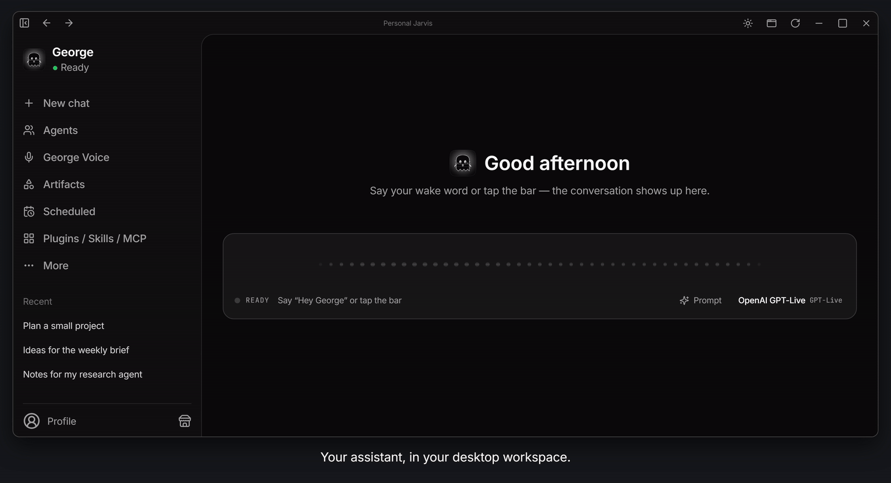
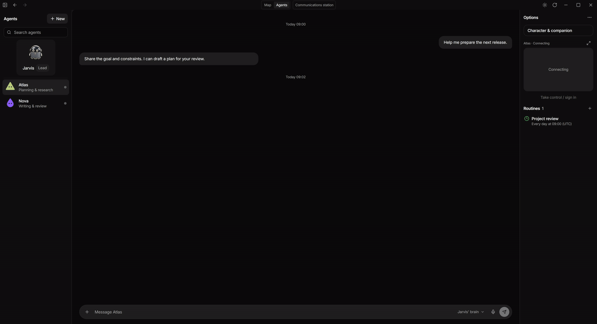

<p align="center">
  
</p>

<h2 align="center">Your personal AI ecosystem. One desktop, connected by voice.</h2>

<p align="center">
  Talk to Jarvis. Work with your agents. Bring your tools, models, and knowledge together.<br />
  An open-source workspace for conversations and the work that follows.
</p>

<p align="center">
  <a href="https://pypi.org/project/personal-jarvis/"></a>
  <a href="LICENSE"></a>
  <a href="https://discord.gg/x7USduHxbc"></a>
</p>

**Personal Jarvis is an open-source AI ecosystem that runs on your own computer.**
At its center is Jarvis, a voice orchestrator that connects a conversation to
[agents](#jarvis-agents), [coding sessions](#coding-workspace), desktop actions,
and the services you choose to connect. Speak naturally or type a message:
Jarvis can answer, use a tool, or delegate work while you follow the conversation
and inspect what happens. The desktop app brings those conversations, your team,
and their results into one workspace on Windows, macOS, and Linux.

The workspace extends beyond the conversation. Build persistent specialists with
their own instructions and recurring routines. Use [Jarvis Voice](#jarvis-voice-dictation)
to dictate into other apps. Connect [plugins, skills, and MCP servers](#plugins-skills-and-mcp),
work alongside coding CLIs, keep knowledge in a [local Markdown wiki](#memory-and-knowledge),
and open generated reports, pages, and files in [Artifacts](#artifacts-and-run-history).
These are connected parts of the same application: a request can start with your
voice, continue with an agent, and leave behind something you can read, use, or edit.

**Choose the models and services that fit your work.** Jarvis supports hosted
providers, [local models](#local-models), and mixed setups. Your selected provider
supplies the intelligence; Jarvis manages application state, tool access,
approvals, and execution. Local speech and model options can keep supported
work on your hardware. Cloud models and connected services receive the content
needed for their requests; running the app locally does not make every integration
offline. See [privacy and local data](docs/product/privacy-safety-and-support/privacy-and-local-data.md)
and [how the system fits together](#how-it-works).

[Website](https://personaljarvis.ai) · [Getting started](#your-first-steps-in-the-desktop-app) ·
[Documentation](#documentation) · [GitHub](https://github.com/PersonalJarvis/PersonalJarvis) ·
[YouTube](https://www.youtube.com/@PersonalJarvis) ·
[Discord](https://discord.gg/x7USduHxbc) · [X](https://x.com/Ruben_Luetke) ·
[Instagram](https://www.instagram.com/personaljarvis/)

## Install

**Windows — PowerShell**

```powershell
irm https://raw.githubusercontent.com/PersonalJarvis/PersonalJarvis/main/install/install.ps1 | iex
```

**macOS and Linux**

```bash
curl -fsSL https://raw.githubusercontent.com/PersonalJarvis/PersonalJarvis/main/install/install.sh | bash
```

The installer checks Python 3.11+ and Git, offers to install missing prerequisites
through the host package manager, installs the applicable desktop components,
registers the desktop launcher, and opens the app. Language, wake phrase, and provider setup happen in the app.
OS permissions and hardware capabilities affect voice and desktop control.
Re-running the installer updates an existing installation.

Personal Jarvis is free and open source. Hosted models, coding subscriptions,
and optional services are billed by their respective providers. Supported local
models do not require a cloud model account.

[Full installation, platform requirements, and uninstall instructions](install/README.md).

## Jarvis: your voice orchestrator

Start a **Voice Chat**, tap the voice bar, or use your configured wake phrase.
Your speech and Jarvis's replies appear in the conversation. Start a normal
**Chat** when you prefer a keyboard.

Jarvis brings the workspace into reach: ask an agent to research a topic, work
with a coding session, find something in memory, or use a connected tool.
Available actions depend on your providers, installed tools, and permissions.
Computer use needs a desktop and the required OS permissions.

Choose your voice and model access in the app. The voice path can use realtime
audio or a speech-recognition, model, and speech-output pipeline. Your selected
provider determines the available capabilities; execution and approvals remain
under Jarvis's control.

<br />

<p align="center">
  <a href="assets/demo/readme-2026-09/jarvis-orchestrator-v4.mp4">
    
  </a>
</p>

<p align="center">
  <sub>“Hey George” → listening → conversation. The desktop window and navigation stay in view.</sub>
</p>

The demos on this page are **Remotion recreations of the interface with
illustrative conversations**, not live recordings or response-time benchmarks.
The wake phrase and listening transition above are animated to explain the
interaction. Click a GIF for its sharper 60 fps video, or use the
[still previews and reproducible source](scripts/readme-video/README.md).

[Voice conversations](docs/product/everyday-use/voice-conversations.md) ·
[Wake phrase and audio](docs/product/personalize-and-connect/audio-and-wake-word.md) ·
[Models and providers](docs/product/personalize-and-connect/providers-and-api-keys.md)

<br />

## Your first steps in the desktop app

1. **Open Personal Jarvis.** The installer opens the desktop app for you. Later,
   find **Personal Jarvis** in Windows Search, macOS Spotlight, or the Linux
   application menu. You do not need to keep a terminal open.
2. **Complete the in-app setup.** Choose your language, review device permissions,
   and choose a wake phrase or a keyboard shortcut. The assistant name follows
   your chosen phrase: **Hey George** is the example above, not a required name.
3. **Connect model access.** Open **API Keys & Providers** to connect and test a
   supported provider, or configure a local model. Chat needs a ready model;
   voice additionally needs a working realtime connection or speech pipeline.
4. **Start a conversation.** Use **New chat** to choose **Chat** or **Voice Chat**.
   For voice, wait for readiness and use your wake phrase, shortcut, or the voice
   bar. Try: *"Help me plan a small project. Ask me what you need to know."*
5. **Build out your workspace.** Add a specialist under **Agents**, connect a
   service in **Plugins / Skills / MCP**, or open **Jarvis Voice** for dictation.
   Find generated files in **Artifacts** and recurring work under **Scheduled**.

The sidebar keeps these areas within reach. **More** opens additional views,
including knowledge, coding tools, settings, and help. Voice Chat is a conversation
with Jarvis; **Jarvis Voice is speech-to-text for the app you are already using**.

[First-run setup](docs/product/start-here/first-run-setup.md) ·
[First chat](docs/product/start-here/start-your-first-chat.md) ·
[First voice conversation](docs/product/start-here/start-your-first-voice-conversation.md) ·
[Desktop tour](docs/product/start-here/desktop-app-tour.md)

<details>
<summary>Manual installation and headless use</summary>

```bash
git clone https://github.com/PersonalJarvis/PersonalJarvis.git
cd PersonalJarvis
python -m venv .venv
```

Activate with `.\.venv\Scripts\Activate.ps1` on Windows or
`source .venv/bin/activate` on macOS/Linux, then run:

```bash
pip install -e ".[full]"
jarvis          # Desktop app
jarvis serve    # Headless API and browser UI
```

For a minimal server installation, use `pip install personal-jarvis` and
`jarvis serve`. Open the local address reported at startup; the default is
`http://localhost:47821`. Remote browser microphone access requires HTTPS.
See the [headless deployment guide](docs/headless-vps-deployment.md).

</details>

## Jarvis Agents

Build a team you can return to. Each agent has an identity, a direct conversation,
standing instructions, and access to the tools you grant it. Pick a connected
model or supported agent account for the work, and keep the conversations in
one workspace.

<br />

<p align="center">
  <a href="assets/demo/readme-2026-09/jarvis-agents-v4.mp4">
    
  </a>
</p>

<p align="center">
  <sub>An illustrative agent conversation, from brief to draft. The GIF plays once and holds the reply; click to replay the video.</sub>
</p>

<br />

- **Talk directly to a specialist.** Select an agent from the roster and continue its chat.
- **Give it a standing brief.** Configure its instructions, model access, and tools.
- **Set up recurring work.** Per-agent routines expose instructions, scheduling, and execution history.
- **Inspect its work.** Read messages and tool activity, and open produced files in Artifacts.
- **Explore the world view.** The workspace also has a visual map of the team.

Persistent agents and isolated coding missions have different lifecycles.
Coding missions can use worktree isolation and critic review; an ordinary
agent chat is not a new isolated worktree on every message.

[Agent guide](docs/product/extend-and-automate/jarvis-agents.md) ·
[Agent learning](docs/agent-society/self-learning.md) · [Routines](docs/routines.md)

## Jarvis Voice Dictation

**Speak into the app you already use.** Hold your dictation shortcut or toggle
hands-free recording, then insert the transcript into the focused text field.
Dictation is speech-to-text; Voice Chat is a conversation with Jarvis.

The **Jarvis Voice** section brings together dictation history, your dictionary,
shortcuts, language settings, and speech-provider setup. Optional cleanup improves
the transcript, translation writes into a selected language, and Prompt Mode can
turn a dictation into a structured prompt. Review and recover entries in history
when you need to revisit a transcript.

Choose local speech recognition to process audio on your machine. Provider-backed
cleanup or translation can still send text to the configured provider.

[Dictation guide](docs/product/everyday-use/dictation.md) ·
[Speech dictionary](docs/product/everyday-use/speech-dictionary.md) ·
[Languages and voices](docs/product/personalize-and-connect/languages-and-voices.md)

## Local models

Use local models, hosted providers, or a mixture. **Local models** helps you
discover the local server, see available models, configure their roles, and
check readiness. Text generation, tools, and image input have different model
requirements.

| Part | Local option |
|---|---|
| Model and tools | Ollama or a compatible local OpenAI-style endpoint. Tool support depends on the model. |
| Speech recognition | On-device Whisper or Nemotron, with the corresponding engine and model installed. |
| Speech output | On-device Piper voices. |
| Realtime conversation | A compatible self-hosted realtime server; experimental, with its own hardware requirements. |

Downloads, hardware needs, languages, and capabilities vary by model.
External APIs, hosted coding accounts, connected services, and telephony still
send the relevant work to those services.

[Local AI setup](docs/product/personalize-and-connect/local-ai-providers.md) ·
[Provider setup](docs/product/personalize-and-connect/providers-and-api-keys.md)

## Coding workspace

Bring supported coding CLIs into **Agentic IDE** with a project folder and live
terminal panes. Work with tools such as Claude Code or Codex using the access
supported by that tool, and keep their sessions visible alongside the rest of
Jarvis. Terminal and chat views provide different ways to follow the work.

Panes have call signs so you can address a particular session through Jarvis:
*"Tell T1 to run the tests"* or *"What is T2 working on?"* Return to the workspace
to inspect output, respond to a prompt, or take over manually. A terminal becoming
idle is not proof that its result is correct; inspect its changes and validation.

Ordinary command-line connections are managed separately from interactive coding
panes. **CLIs & CLI Test Hub** helps discover, configure, and test those tools
before you ask Jarvis to use them.

[Agentic IDE](docs/product/extend-and-automate/agentic-ide.md) ·
[CLI connections](docs/product/extend-and-automate/cli-connections.md)

## Plugins, skills, and MCP

Connect the workspace to the tools you already use, and extend how Jarvis works
without replacing the assistant. The **Plugins / Skills / MCP** hub separates
three complementary kinds of extension:

| Extension | What it adds | Learn more |
|---|---|---|
| **Plugins** | Connections to supported services and their tools, with their own setup and connection state. | [Plugin guide](docs/product/extend-and-automate/plugins.md) |
| **Skills** | Reusable instructions for a task or workflow, with explicit activation and configuration. | [Skill guide](docs/product/extend-and-automate/skills.md) |
| **MCP servers** | Tools supplied by local or remote Model Context Protocol servers, according to granted access. | [MCP connections](docs/product/extend-and-automate/mcp-connections.md) |

Connect the services you need and inspect their status in the app. A tool being
listed does not establish that its account is connected or that a particular
action will succeed. Authentication requirements and permissions vary by
integration. For a self-hosted example, see
[connecting Home Assistant](docs/product/extend-and-automate/connect-home-assistant.md).

## Memory and knowledge

Keep reusable knowledge in the **Knowledge Wiki**, a local Markdown vault with
pages, links, and a visual memory map. It gives facts and notes a place beyond a
single conversation, and lets you browse the material that later work can use.
You can also connect the vault to Obsidian.

Profile information, contacts, and standing instructions add different kinds of
context. Use them to describe preferences and people, and shape the assistant's
behavior. They are editable parts of your workspace, so you do not need to repeat
the same background in every prompt.

[Wiki and memory](docs/product/knowledge-and-sharing/wiki-and-memory.md) ·
[Obsidian](docs/product/knowledge-and-sharing/connect-obsidian.md) ·
[Profile and contacts](docs/product/everyday-use/profile-and-contacts.md) ·
[Instructions and persona](docs/product/personalize-and-connect/instructions-and-persona.md)

## Scheduled work and workflows

Recurring work belongs in a schedule. Use agent routines for a specialist's
recurring brief and the scheduling views to manage tasks and inspect their run
history. Instructions, timing, and previous executions stay visible so you can
change the work as your needs change.

Workflows and app commands provide additional ways to trigger supported actions.
Scheduling depends on the relevant Jarvis runtime being available and the required
providers and connections being ready; saving a schedule is not a completed run.

[Routines](docs/routines.md) ·
[Tasks and reminders](docs/product/everyday-use/tasks-and-reminders.md) ·
[Workflows and commands](docs/product/extend-and-automate/workflows-and-commands.md)

## Computer use and connected channels

Jarvis can interact with desktop applications through the configured computer-use
path. Screen context supplies visual information; computer use goes further and
can act through the mouse and keyboard. Desktop access and the required OS
permissions are necessary, and actions pass through the configured safety policy.

Optional messaging channels and Twilio calling extend the ways requests and
conversations reach the system. These need their own supported accounts and setup.
Calling is a hosted-service capability, not an offline feature; the
[phone-call guide](docs/product/personalize-and-connect/phone-calls.md) covers
numbers, credentials, and webhooks.

[Computer use](docs/product/extend-and-automate/computer-use.md) ·
[Screen context](docs/product/extend-and-automate/screen-context.md) ·
[Permissions](docs/product/privacy-safety-and-support/permissions.md)

## Artifacts and run history

A conversation can produce something you keep. **Artifacts** brings generated
reports, documents, pages, images, and other files together for preview and
download. Follow the output back to the work that produced it, then open or reuse
it outside Jarvis.

Session history and **Run Inspector** help explain what happened: recorded turns,
tool activity, timing, and errors. **Spend** shows recorded provider usage and
available cost information, including supported coding-session usage. Coverage
depends on what each provider and execution path reports.

[Outputs and files](docs/product/everyday-use/outputs-and-files.md) ·
[Sessions and Run Inspector](docs/product/everyday-use/sessions-and-run-inspector.md)

## How it works

The desktop is a **React/TypeScript interface inside a pywebview window**, backed
by a **Python/FastAPI application**. REST endpoints handle application operations;
WebSockets deliver live state and activity. Headless mode exposes the API and
browser interface without the native desktop shell.

```text
Desktop / browser / voice / CLI / connected channels
                         |
                    Jarvis core
       context, capabilities, routing, cancellation
                         |
       +-----------------+------------------+
       |                 |                  |
  Model response    Protected tools    Delegated work
  voice or text     plugins / MCP /    persistent agents
                    CLI / desktop     or coding missions
       |                 |                  |
       +-----------------+------------------+
                         |
            Live events, saved history,
              memory, and artifacts
```

The execution path follows the request and available capabilities. A simple
answer can stay in the conversation; a service action needs an available tool;
longer work can run through an agent or mission lifecycle. Persistent agent chats
and worktree-isolated missions remain distinct.

| Boundary | Technical role |
|---|---|
| **Protocols** | Shared contracts in `jarvis/core/protocols.py` separate orchestration from provider and platform implementations. |
| **Event bus** | Typed, immutable events carry trace IDs so components exchange activity without direct coupling. |
| **Streaming providers** | Brain, speech, and harness interfaces stream output; realtime sessions handle live audio through their selected provider. |
| **Tool executor** | A central execution path applies the risk policy and approval requirements before an action runs. |
| **Mission lifecycle** | Coding missions can use isolated Git worktrees, progress events, critic review, cancellation, and retained output. |
| **Extension points** | Provider plugins use Python entry points; MCP servers and connected services contribute tools through their adapters. |
| **Persistence** | Conversations and run records use dedicated stores, the Knowledge Wiki uses local Markdown, and credentials use the secret-storage layer. |

For the current live-voice path, see [GPT-Live](docs/gpt-live.md). For deeper
engineering detail, read the [architecture overview](docs/architecture-overview.md),
[architecture decisions](docs/adr/), and [OS parity](docs/os-parity.md).

## Configuration, privacy, and control

Configure providers and credentials in the app. Keys use the operating system's
credential store when available, with supported environment/file fallback for
other setups. Keep secrets out of chat, `jarvis.toml`, and version control.
The [configuration example](jarvis.toml.example) documents advanced settings.

Wake-word listening runs locally. Your speech and model providers determine
where subsequent audio, text, and tool context are processed. The Knowledge
Wiki stays in local files; integrations receive the information needed for the
actions you ask them to perform.

Tool execution uses a risk policy with **safe, monitor, ask, and block** tiers.
Permissions, approvals, and run history let you inspect and control actions.

For scripts and other agents, the CLI reaches the same application API:

```bash
jarvis system status
jarvis --json brain status
jarvis api <tag> <op>
```

[CLI guide](docs/jarvis-cli.md) ·
[Control API](docs/product/reference/control-api-reference.md) ·
[Safety and approvals](docs/product/privacy-safety-and-support/safety-and-approvals.md) ·
[Privacy](docs/product/privacy-safety-and-support/privacy-and-local-data.md) ·
[Security policy](SECURITY.md)

## Documentation

Open **Docs** in the app for searchable product guides, or follow the topics here.

| Guide | Contents |
|---|---|
| [Getting started](docs/product/start-here/welcome-to-personal-jarvis.md) | Installation, first conversation, and desktop tour. |
| [Dictation](docs/product/everyday-use/dictation.md) | Shortcuts, history, cleanup, and speech input. |
| [Plugins](docs/product/extend-and-automate/plugins.md) | Connect services and inspect their status. |
| [Skills](docs/product/extend-and-automate/skills.md) | Reusable instructions and workflows. |
| [MCP](docs/product/extend-and-automate/mcp-connections.md) | Local and remote tool servers. |
| [Local AI](docs/product/personalize-and-connect/local-ai-providers.md) | Model setup and capability checks. |
| [Troubleshooting](docs/product/privacy-safety-and-support/troubleshooting.md) | Setup, connection, and device problems. |
| [Architecture](docs/architecture-overview.md) | Components, data flow, and provider boundaries. |
| [GPT-Live](docs/gpt-live.md) | The native live-voice path and tool execution. |
| [Agent learning](docs/agent-society/self-learning.md) | Private, evidence-backed learning for persistent agents. |
| [Routines](docs/routines.md) | Scheduling and recurring work. |
| [OS parity](docs/os-parity.md) | Platform coverage and limitations. |
| [Contributor guide](CONTRIBUTING.md) | Development setup and pull requests. |
| [Architecture decisions](docs/adr/) | Design decisions and their context. |
| [README media source](scripts/readme-video/README.md) | Provenance, example data, still previews, and rendering commands. |

## Community and contributing

Follow the project on the [website](https://personaljarvis.ai),
[X](https://x.com/Ruben_Luetke), and
[Instagram](https://www.instagram.com/personaljarvis/).

Questions, ideas, and bug reports are welcome on [Discord](https://discord.gg/x7USduHxbc)
and [GitHub](https://github.com/PersonalJarvis/PersonalJarvis/issues/new/choose).
Watch walkthroughs on the [Personal Jarvis channel](https://www.youtube.com/@PersonalJarvis).

Read [CONTRIBUTING.md](CONTRIBUTING.md) before a pull request. Hardware reports,
provider integrations, accessibility improvements, and native-language feedback
are especially useful. AI-assisted contributions are welcome; review focuses
on the change and its evidence. Repository contributions are written in English.
Report vulnerabilities privately through [SECURITY.md](SECURITY.md).

## Contributors

<!-- contributors:start -->

<a href="https://github.com/rubenluetke10-beep"></a>

<!-- contributors:end -->

Thank you to everyone who contributes. This wall is updated from commit history.

## License

[Apache 2.0](LICENSE): free to use, modify, and distribute, including commercially.
See [NOTICE](NOTICE), [licensing details](docs/licensing.md), and
[trademark guidance](TRADEMARK.md). Releases through version 1.6.0 retain their
original MIT license.
