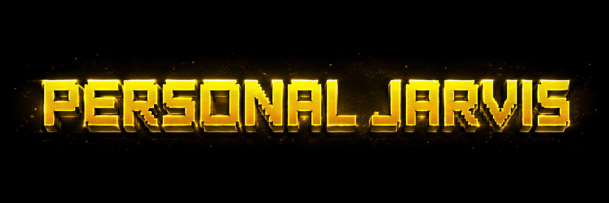
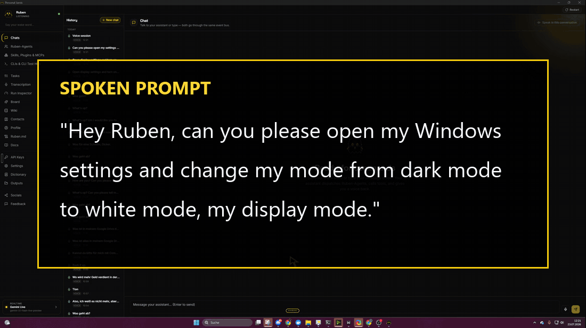
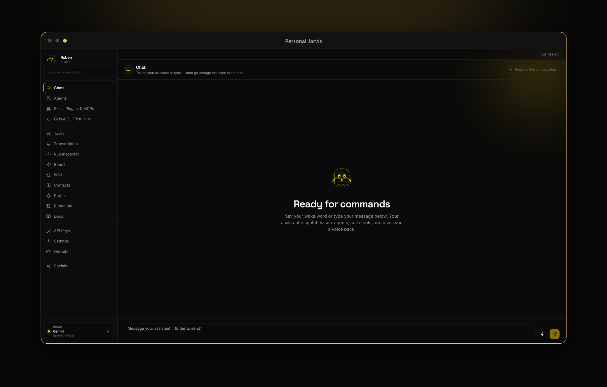
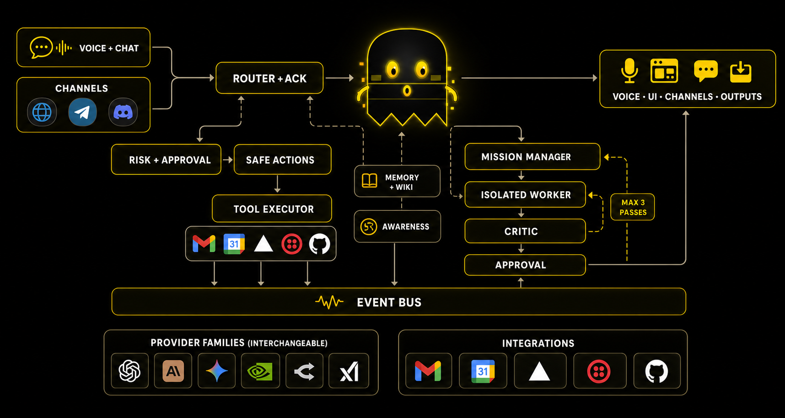

<p align="center">
  <a href="https://github.com/PersonalJarvis/PersonalJarvis">
    
  </a>
</p>

<p align="center">
  <a href="https://github.com/PersonalJarvis/PersonalJarvis/releases"></a>
  <a href="LICENSE"></a>
  <a href="https://discord.gg/x7USduHxbc"></a>
  <a href="https://personaljarvis.ai/"></a>
  
  
</p>

<p align="center">
  <b>Your own AI assistant — on your machine, in your voice, with your keys.</b>
</p>

<p align="center">
  <sub>Open source · runs on Windows, macOS, Linux and a $5 VPS · bring any provider you already pay for</sub>
</p>

---

You say something, and it answers immediately — while the real thinking is
still running behind it. It remembers what you told it three weeks ago. It
hands the long jobs to its own background agents, which work in a sandbox and
get reviewed before you ever hear the result. It reads your calendar, writes
files to your disk, drives your CLIs, and — when you ask it to — takes the
mouse.

It is not tied to one AI company. Gemini, Claude, OpenAI, Grok, OpenRouter,
NVIDIA: use whichever key or subscription you already have. If one goes down,
runs out, or you never had it, Jarvis crosses to another family and tells you
it did. No provider in here is load-bearing.

## Say it out loud

| You say | What actually happens |
|---|---|
| *"Research the three best vector databases for a two-person team and write it up."* | A background agent starts in its own isolated Git worktree, works, gets checked by a critic, and drops a finished Markdown report in **Outputs**. |
| *"Remember that Alex hates phone calls. Always text him."* | It lands in your Wiki. Every future session knows it — and it's a plain Markdown file on your disk you can open, edit, or sync to Obsidian. |
| *"What's on my calendar tomorrow? Mail Tom the summary."* | Google Calendar and Gmail, through your own OAuth connection. Not a scraper. |
| *"Open display settings and turn on night light."* | Jarvis takes the mouse and keyboard, with a border around the screen so you always see when it's driving. |
| *"Every weekday at 7:30, brief me on what's due."* | A saved task fires on schedule and speaks it. |
| *"Switch to Claude."* | The brain provider changes mid-conversation. No restart. No config file. |
| *"Send a background agent to fix the failing test in this repo."* | Your existing Claude Code, Codex or Antigravity subscription login does the coding, as a mission you can watch tool call by tool call. |

## Watch it work (computer-use demo)

<p align="center">
  <a href="https://www.youtube.com/watch?v=6xoxgNu5fd8">
    
  </a>
</p>

<p align="center">
  <sub>One spoken request; Jarvis opens Settings and changes the accent color itself. Real screen recording, sped up, nothing faked &middot; <a href="https://www.youtube.com/watch?v=6xoxgNu5fd8">watch the full demo on YouTube</a></sub>
</p>

That clip shows the loudest trick, not the main one. Most days Jarvis is the
thing you talk to while you work: it answers, it remembers, it delegates. The
screen control is there for the times an app has no API.

## Read this before you install

Honesty is worth more here than a bigger promise, so here is the unvarnished
version.

**This is a young project, and it is built by one person.** It hit its first
public release on 3 July 2026, and 17 releases have shipped in the three weeks
since. That pace is a feature and a warning at the same time: things move fast,
and things break.

**It is for developers and tinkerers.** You should be comfortable with a
terminal, an API key, and a program that occasionally misbehaves. If you want a
polished consumer assistant that your parents could install, this is not it
yet — and pretending otherwise would waste your evening.

**It can drive your computer.** It clicks, types, opens apps, and can run shell
commands. Every action passes a four-tier safety check first (`safe` /
`monitor` / `ask` / `block`), destructive things ask before they run, and
Jarvis stops on its own at password fields and 2FA prompts. On my machine,
nothing bad has ever happened — nothing deleted, no click that cost me
anything. **But that is one machine and one setup, and I can't promise the same
for yours.** Install it somewhere a bad day would be annoying, not
catastrophic.

**Nothing is bundled.** No keys, no free tier, no hosted backend. You bring a
provider, and you pay that provider directly for what you use.

### What works, and what doesn't yet

| Area | Honest status |
|---|---|
| Chat, voice pipeline, background agents, Wiki memory, provider fallback | **Solid.** This is the daily-driver path and it gets used every day. |
| Computer use | **Works, and genuinely useful** — but a model clicking around your screen is still a model clicking around your screen. Start with something small and watch it. |
| Realtime voice (OpenAI Realtime, Gemini Live) | **Research preview.** Sub-second and lovely when it works; fewer tools are available, and it falls back to the classic wake → speech → brain → voice pipeline. |
| Workflows | **Experimental.** The app can run, inspect, enable and delete them — creating one still needs the CLI or the Control API. |
| Jarvis Board | **Experimental.** Local activity stats and a share image. Achievements, feed and pairing exist as services but have no finished UI. |
| Phone calls (Twilio) | **Experimental.** Tests cover the routes, audio conversion and a simulated media stream. There is no recorded live phone-network sign-off. |
| macOS | Every platform seam has a real macOS backend and CI runs a macOS leg — but the repo holds **no dated live desktop sign-off**. Treat a first run as a test. |
| Linux desktop | X11 is covered. **Wayland** loses idle detection, window focus and the multi-monitor bar — each degrades to an honest log line, never a crash. |
| Headless Linux server | **Fully supported**, and the smallest install. No local audio; use browser voice over HTTPS. |

Every known gap has a public paper trail: [`docs/os-parity.md`](docs/os-parity.md)
lists the platform gaps one by one, and [`docs/BUGS.md`](docs/BUGS.md) holds 93
bug entries with their root causes. Competitors can copy a feature list. They
can't copy a bug register.

## Install

One command on **Windows, macOS, or Linux**. You need **Python 3.11+** and
**Git** — the installer checks both and stops with a download link if one is
missing. It asks nothing in the terminal, launches the app, and the app walks
you through a one-time setup: language, wake word, keys.

**Windows** — PowerShell

```powershell
irm https://raw.githubusercontent.com/PersonalJarvis/PersonalJarvis/main/install/install.ps1 | iex
```

**macOS · Linux**

```bash
curl -fsSL https://raw.githubusercontent.com/PersonalJarvis/PersonalJarvis/main/install/install.sh | bash
```

> It's open source — read the installer before you pipe it into a shell. It
> creates a venv, installs dependencies, prefetches the voice models, and
> starts the app. Keys go into your OS credential manager, never into the repo.
> Re-running the same one-liner updates in place.

<details>
<summary><b>Optional extras, install flags, pipx, manual clone</b></summary>

<br/>

Everything below is optional. Each item unlocks exactly one thing:

| Optional | Unlocks |
|---|---|
| A provider **API key or subscription login** — Gemini, Claude, OpenAI, Grok, OpenRouter, NVIDIA | Actually talking to a brain. Added in-app; stored in your OS credential manager. |
| **Node.js 18+** | The coding-agent CLIs (Claude Code, Codex, Antigravity) that heavy missions delegate to. Add it any time. |
| **libportaudio** *(Linux only)* | Local microphone and speakers — `apt install libportaudio2`. |
| **xdotool** *(Linux X11 only)* | Typing umlauts, emoji and non-Latin text during computer use. The installer tries to provide it. |
| A **GPU** | Faster fully-offline speech. Everything also runs on CPU; torch is not in the base install. |

| Install flag | Effect |
|---|---|
| `--headless` | Minimal server install: API + WebSocket + browser UI, torch-free base, no Node.js — the tiny-VPS path |
| `--no-launch` | Install only, don't start the app |

**pipx** — isolated, no clone, any OS:

```bash
pipx install "git+https://github.com/PersonalJarvis/PersonalJarvis" && jarvis serve
```

**Manual** — clone it, read every line, then run:

```bash
git clone https://github.com/PersonalJarvis/PersonalJarvis
cd PersonalJarvis
python -m venv .venv && source .venv/bin/activate   # Windows: .\.venv\Scripts\Activate.ps1
pip install -e ".[full]"
jarvis serve
```

To remove Jarvis again: `jarvis --uninstall` (add `--dry-run` first to see
exactly what it would delete).

</details>

## Run it

```bash
jarvis          # full desktop: window + voice + Jarvis Bar overlay
jarvis serve    # headless: API + WebSocket + browser UI, no local audio needed
```

<p align="center">
  
</p>

<details>
<summary><b>Headless / server notes</b></summary>

<br/>

On a server, open **http://localhost:47821**. The full experience lives in the
browser, voice included, through the browser microphone. The one-time setup
runs there too; you can also set a provider key (e.g. `GEMINI_API_KEY`) in the
environment or a `.env` file.

Browser microphone access needs a secure context. `localhost` works as-is. For
a remote VPS, terminate TLS with a reverse proxy (Caddy, Nginx) — plain
`http://server-ip` stays fine for text, but browsers block the mic.

</details>

## What you get

**A voice you can interrupt.** Wake word → speech-to-text → brain →
text-to-speech, fully streaming, in English, German or Spanish. Conversation
mode keeps the mic open for a natural follow-up. A fast ack replies while the
deep answer is still being written, so you never sit in silence wondering
whether it heard you. Pick your own wake word — nothing is preset.

**Agents that check their own work.** Anything non-trivial becomes a mission: a
worker starts in a fresh, isolated `git worktree` with crash containment, does
the job, and a critic reviews the result — up to three rounds — before it
reaches you. Deliverables land in **Outputs** as real files. You can watch
every tool call live in the Agents view.

**Memory that survives restarts.** The Knowledge Wiki is an Obsidian-compatible
Markdown vault that Jarvis reads and writes. It learns from how you talk, not
only from literal instructions, and marks inferred facts as inferred. It's
plain files on your disk: read them, edit them, sync them, delete them.

**Your tools, connected.** Google Calendar, Gmail and Drive over your own
OAuth. MCP servers. A catalog of ~20 command-line tools (gh, docker, kubectl,
stripe, vercel, supabase …) that Jarvis can drive as tools. Skills you write
yourself. Telegram and Discord as extra front doors to the same brain and the
same memory.

**Computer use, when there's no API.** Jarvis captures the target window, picks
an action, performs it, and looks again to verify. It stops on password fields,
2FA prompts and human-verification challenges, and an on-screen border shows
you when it has the wheel.

**Safety you can reason about.** Four tiers — `safe`, `monitor`, `ask`,
`block` — with the blacklist always outranking the whitelist. Generated skills
land as *drafts* and never self-activate. Self-modification goes through
validate → backup → apply → verify → roll back, with an audit trail.

**Everything is a REST route.** Which means everything is also a CLI command,
and everything is scriptable. That's a hard rule in this repo, enforced in CI.

## How it works



A lean **router brain** listens and decides. It doesn't do the work — it
dispatches. Small things are answered or executed directly; big things go to a
harness (a coding CLI, an MCP server, computer use) as a reviewed mission.
That's the whole trick, and it's why swapping a provider or a harness doesn't
touch anything else.

<details>
<summary><b>The 8-layer map</b></summary>

```
L7  UI/UX           Desktop app (FastAPI + React + pywebview), tray, Jarvis Bar overlay
L6  Orchestrator    State machine, Router, BrainManager, Mission-Manager, Controller
L5  Harness adapter Mission workers (Claude Code, Codex, Antigravity), MCP, computer use, Python
L4  Brain           Gemini · Claude · OpenAI · Grok · OpenRouter · NVIDIA  +  fast ack tier
L3  Intent / Risk   Classifier, four-tier risk policy, approval, rate-limit tracking
L2  Speech          Wake → VAD → STT → TTS  (cloud or local, your choice)
L1  Audio I/O       Device routing, chime feedback
L0  OS / Hardware   Mic, speakers, global hotkeys, optional GPU
```

Higher layers reach lower ones **only through protocols**
([`jarvis/core/protocols.py`](jarvis/core/protocols.py)); everything else talks
over a typed, immutable **EventBus** carrying a trace ID. One broken subscriber
is logged, never propagated.

The deeper engineering map — anti-patterns, recurring bug classes, phase status
with `file:line` references — lives in
[`docs/LLM-CONTEXT.md`](docs/LLM-CONTEXT.md), written to be pasted into an LLM
chat whole.

</details>

## Drive it from the terminal

The `jarvis` CLI (aliases `jarvisctl`, `jctl`) controls a **running** instance.
Same actions as the app, same safety checks, just scriptable — by you, by a
cron job, or by another coding agent:

```bash
jarvis system status          # {"reachable": true} when Jarvis is up
jarvis --json brain status    # which provider is live, machine-readable
jarvis api <tag> <op>         # every REST endpoint, generated from OpenAPI
```

It's a thin client over the local REST API (`127.0.0.1:47821`), so it inherits
every guardrail — risk tiers, atomic config writes, the audit log — instead of
going around them. Full guide: [`docs/jarvis-cli.md`](docs/jarvis-cli.md).

## Configure it

You don't need a config file. Every setting has a default, and the in-app setup
covers the rest. For fine control there is one optional, documented file
([`jarvis.toml.example`](jarvis.toml.example)):

```toml
[profile]
language = "auto"          # en | de | es | auto

[trigger.wake_word]
phrase = ""                # YOUR word — nothing is preset for you
engine = "auto"            # resolves the best engine for your phrase

[stt]
provider = "groq-api"      # or openai-api, gemini-api, openrouter-stt

[tts]
provider = "gemini-flash-tts"
fallback = "grok-voice"    # cross-provider fallback is the norm everywhere
```

Overrides cascade `jarvis.toml → ENV` (`JARVIS__SECTION__KEY=…`). **Secrets
never go in this file.** Keys live in your OS credential manager (or `.env`),
entered in-app.

## Privacy

- **Your keys stay yours.** OS credential manager, never the repo, never a file
  you could accidentally commit.
- **The always-on part is local.** Wake-word listening runs entirely on your
  machine. Audio only reaches a cloud provider *after* you've addressed Jarvis,
  and only if you chose a cloud provider.
- **Local per stage, your choice.** Speech recognition can run fully offline
  via the `[local-voice]` extra; brain and voice output use whatever you
  configure.
- **Memory is plain files.** The Wiki is Markdown on your disk, not a hosted
  database. Nothing syncs anywhere unless you set that up yourself.
- **The honest part:** a cloud provider you connect sees what it needs to
  answer. Computer use sends a screenshot of the working window to your tool
  model. Both are stated in the app before you turn them on.

## Build on it

Every pluggable part is a Python **entry point**. Write a class against the
protocols in [`jarvis/core/protocols.py`](jarvis/core/protocols.py), register
one line in `pyproject.toml`, reinstall. No fork, no core edits.

| Plugin group | What you can add |
|---|---|
| `jarvis.brain` | A new LLM provider |
| `jarvis.stt` / `jarvis.tts` | Speech recognition / synthesis backends |
| `jarvis.wakeword` | Wake-word engines |
| `jarvis.realtime` | Speech-to-speech providers |
| `jarvis.harness` | Agent harnesses missions delegate to |
| `jarvis.tool` | Actions the router can call directly |
| `jarvis.channel` | New front doors — chat platforms, transports |

Three rules keep it stable: implement the protocol, stream everything
(`AsyncIterator`; non-streaming yields one element), and pass the contract
suite (`pytest tests/contract/`).

<details>
<summary><b>Project structure</b></summary>

```text
PersonalJarvis/
├── jarvis/          # The application — brain, speech, missions, memory, UI server…
├── ui/              # Jarvis Bar / Orb overlay for the desktop, loaded at runtime
├── board-backend/   # Standalone federation service (verifies signed Board aggregates)
├── conductor/       # YAML-first agentic-workflow canvas, mounted inside the app
├── wiki/            # Seed knowledge vault (Obsidian-compatible), created on first run
├── install/         # One-line installers + signed-release verification
├── tests/           # 1,300+ test modules: unit, integration, contract, end-to-end
├── docs/            # Architecture, 30 ADRs, the bug register, the doctrine
├── scripts/ci/      # 14 fail-closed repo gates (boot budget, CLI coverage, secrets…)
├── assets/          # Brand art, banner, screenshots, demo
├── scoop-bucket/    # Windows install manifest (Scoop)
├── homebrew-tap/    # macOS install formula (Homebrew)
└── README · LICENSE · CODE_OF_CONDUCT · CONTRIBUTING · SECURITY · CHANGELOG
```

Inside `jarvis/`, the layout mirrors the 8-layer model: `jarvis/brain/`
(providers + router), `jarvis/speech/` (wake → VAD → STT → TTS),
`jarvis/missions/` (the self-healing worker-critic), `jarvis/memory/wiki/`
(long-term memory), `jarvis/ui/web/` (the app).

</details>

## Documentation

| Document | What's in it |
|---|---|
| [`docs/product/`](docs/product/) | The end-user manual — install, first run, every feature, honestly scoped |
| [`docs/architecture-overview.md`](docs/architecture-overview.md) | Full architecture: layers, module catalog, data flow |
| [`docs/LLM-CONTEXT.md`](docs/LLM-CONTEXT.md) | Dense project snapshot, built to paste into an LLM chat whole |
| [`CLAUDE.md`](CLAUDE.md) | Binding contributor guide — conventions, doctrine, anti-patterns |
| [`docs/BUGS.md`](docs/BUGS.md) | The recurring-bug register, root causes included |
| [`docs/os-parity.md`](docs/os-parity.md) | Every open macOS / Linux gap, tracked |
| [`docs/adr/`](docs/adr/) | 30 Architecture Decision Records |
| [`CHANGELOG.md`](CHANGELOG.md) | What changed in every release |

## Community

Personal Jarvis is built in the open — the roadmap, the bug hunts and the wins
land on Discord first. If you break it, that's genuinely useful to me. Come and
tell me how.

<p align="center">
  <a href="https://discord.gg/x7USduHxbc"></a>
  <a href="https://x.com/Ruben_Luetke"></a>
</p>

<p align="center">
  <a href="https://discord.gg/x7USduHxbc">Discord</a> ·
  <a href="https://x.com/Ruben_Luetke">@Ruben_Luetke</a> ·
  <a href="https://www.instagram.com/personaljarvis/">Instagram</a> ·
  <a href="https://personaljarvis.ai/">Website</a>
</p>

## Contributing

Pull requests are welcome — [`CONTRIBUTING.md`](CONTRIBUTING.md) has the full
guide. The short version: everything committed is English, read
[`CLAUDE.md`](CLAUDE.md) before larger changes, new providers must pass
`pytest tests/contract/`, and security issues go to
[`SECURITY.md`](SECURITY.md) privately — not into a public issue.

## License

**MIT** — free to use, modify and distribute, including commercially. See
[`LICENSE`](LICENSE). Third-party names and logos belong to their owners; see
[`TRADEMARK.md`](TRADEMARK.md).

---

**P.S.** — If you read only one section, read
[Read this before you install](#read-this-before-you-install). This is a young,
one-person project that can take control of your computer. It is genuinely
useful, and it is genuinely early. Put it on a machine where a bad day would be
annoying rather than catastrophic, then
[tell me what broke](https://discord.gg/x7USduHxbc).

<br/>

<p align="center">
  <sub>Created by <b>Ruben Lütke</b> · <a href="https://x.com/Ruben_Luetke">@Ruben_Luetke</a> · © 2026 · MIT</sub><br/> <!-- i18n-allow: maintainer's name, not German prose -->
  <sub><a href="https://discord.gg/x7USduHxbc">Discord</a> · <a href="https://x.com/Ruben_Luetke">X</a> · <a href="https://www.instagram.com/personaljarvis/">Instagram</a></sub>
</p>
