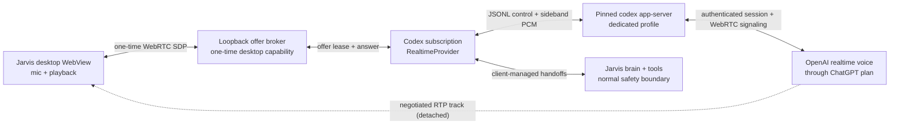

# ChatGPT-plan realtime voice through Codex

Status: experimental, opt-in, and pinned to Codex CLI 0.146.0
Last verified: 2026-07-31

## Bottom line

ChatGPT Voice is not exposed as a general-purpose subscription API. Codex does,
however, expose an official experimental realtime surface through
`codex app-server`. It can create a WebRTC voice session while authenticated
with a ChatGPT account. That gives Jarvis a legitimate subscription-routed
transport without automating chatgpt.com, borrowing browser cookies, copying
tokens from another Codex profile, or pretending that an API key is covered by
a ChatGPT subscription.

This is not a promise of unlimited or zero-cost voice. OpenAI controls the plan
allowance and describes Codex and connected Voice as drawing from plan-specific
usage pools. The important billing boundary in Jarvis is simpler: this provider
uses the dedicated ChatGPT login only, while the existing OpenAI Realtime
provider continues to use metered API billing. Jarvis never crosses between the
two silently.

## Why this path is acceptable

The implementation uses documented Codex app-server operations:

- `account/read` confirms that the live process is using ChatGPT authentication
  and reports the plan type.
- `thread/start` creates an ephemeral transport-only thread.
- `thread/realtime/start` accepts a browser-created WebRTC offer and returns the
  answer through a realtime notification.
- `thread/realtime/appendSpeech`, `appendText`, `stop`, and the realtime event
  stream carry Jarvis responses, transcripts, and lifecycle signals.

OpenAI marks the realtime methods as experimental and gives them no backwards-
compatibility guarantee. Jarvis therefore treats the integration as a
versioned adapter, not as a stable protocol that can float with any installed
Codex release.

## Runtime design

The browser/WebView owns the peer connection, while scrubbed sideband PCM stays
on Jarvis's low-latency playback path. Codex uses client-managed handoffs: the
realtime model can answer direct conversational turns, but it is not allowed to
act as a second action-capable assistant. Requests that need memory or tools
return to the ordinary Jarvis brain and ToolExecutor; the resulting safe,
scrubbed text is sent back for speech.

## Billing and fallback rules

| Selection | Authentication | Charging authority | Failure behavior |
|---|---|---|---|
| ChatGPT subscription (Codex) | Dedicated ChatGPT login | ChatGPT/Codex plan limits and any connected-Voice rules set by OpenAI | Stop honestly; never inject an API key |
| OpenAI Realtime | Dedicated or compatible OpenAI API key | OpenAI API usage billing | Follow the user's explicit realtime fallback configuration |
| Other realtime provider | That provider's credential | That provider's billing model | Follow the user's explicit realtime fallback configuration |

Selecting the subscription provider is explicit and requires an experimental-
feature acknowledgement. API Realtime remains a separate selectable provider.
An API provider can be an explicit fallback, but it is never an implicit billing
escape hatch.

This selection covers the realtime voice session and its direct conversational
replies. If a request is handed to Jarvis's separately configured brain or a
tool provider, that provider keeps its own authentication, limits, and billing.
The subscription transport never relabels those calls as ChatGPT-plan usage.

## Credential and process boundaries

The dedicated login lives under Jarvis's data directory in
`codex-subscription-voice`. It is not the user's normal Codex profile. Jarvis
allows only its marker plus the exact files the pinned Codex binary owns:
`auth.json`, a persistent UUID in `installation_id`, the CLI's tiny one-time
`.sandbox_migration` marker (size-bounded), and the bounded `tmp/arg0`
process-launch tree. Codex sends that UUID as a pseudonymous
installation identifier. Jarvis never copies or links credentials into a
second runtime profile. Unexpected config, session, agent, or model files make
startup fail closed, and unsafe linked, reparse-point, or multiply-linked
entries are rejected.

At process launch Jarvis:

1. Requires the exact official Codex 0.146.0 native executable and verifies its
   SHA-256. Windows uses a kill-on-close Job Object. macOS and Linux launch the
   native binary behind a process-group supervisor whose parent-owned lifeline
   pipe kills the group if Jarvis crashes.
2. Forces file-backed auth and strips inherited OpenAI/API billing credentials,
   proxy/provider variables, and keyring-session variables.
3. Supplies isolated temporary home, app-data, log, database, model-catalog,
   prompt, and working directories.
4. Starts app-server with strict configuration and a Jarvis-owned loopback sink
   as the unusable normal model provider.
5. Audits effective config layers, origins, managed requirements, the live
   ChatGPT account, and the returned ephemeral thread before enabling realtime.
6. Starts the thread with no tools, no writable workspace, no roots, no web
   search, no provider fallback, and no startup context.
7. Reaps the whole child process tree and validates Codex's exact
   runtime-artifact layout before and after use. On graceful exit, Codex's own
   locked guard removes the per-process `tmp/arg0` directory; after a crash,
   Codex's next-start lock-aware janitor removes stale directories. Jarvis does
   not race that lock by deleting the tree itself. The non-secret
   `installation_id` remains stable for stock Codex compatibility.

Only personal ChatGPT plan types accepted by the audited protocol are enabled.
Managed workspace accounts are refused because their policy and compliance
requirements cannot safely be inferred by this experimental client.

## Setup and platform behavior

The user installs the supported Codex CLI, opens Providers in Jarvis, and uses
the subscription voice card's Connect action. That launches a fresh interactive
ChatGPT login for this feature only. No API key is requested through chat or
voice.

Windows, macOS, and Linux desktops support the experimental subscription
transport on the approved architectures. Voice capture still follows the
normal host audio capability gate, so a machine without usable audio degrades
honestly. Unsupported architectures receive an explicit unavailable result
without affecting API-backed realtime providers or standard voice.

## Upgrade policy

Do not broaden the CLI version range just because a newer Codex binary starts.
For every supported upgrade:

1. Inspect the exact tagged app-server schema and implementation.
2. Re-run the live strict-config audit with an isolated profile.
3. Verify the official native hashes on all six OS/architecture targets.
4. Re-test account type, managed requirements, config origins, thread
   isolation, WebRTC negotiation, handoffs, teardown, and billing fail-closed
   behavior.
5. Update the user-facing experimental warning if OpenAI changes plan or
   connected-Voice accounting.

## Primary sources

- [Using Codex with your ChatGPT plan](https://help.openai.com/en/articles/11369540-using-codex-with-your-chatgpt-plan)
- [Codex 0.146.0 app-server protocol](https://github.com/openai/codex/blob/rust-v0.146.0/codex-rs/app-server/README.md)
- [OpenAI Realtime API guide](https://developers.openai.com/api/docs/guides/realtime)
