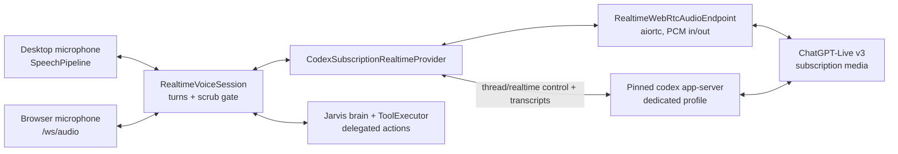

# ChatGPT-plan realtime voice through Codex

Status: experimental, opt-in, and pinned to audited Codex CLI 0.147.0/0.146.0 builds
Last verified: 2026-08-08 (tagged source/schema audit, official artifact hashes, and targeted tests)

## Bottom line

ChatGPT Voice is not exposed as a general-purpose subscription API. Codex does,
however, expose an official experimental realtime surface through
`codex app-server`. It can create a WebRTC voice session while authenticated
with a ChatGPT account. That gives Jarvis a legitimate subscription-routed
transport without automating chatgpt.com, borrowing browser cookies, copying
tokens from another Codex profile, or pretending that an API key is covered by
a ChatGPT subscription.

This is not a promise of unlimited or zero-cost voice. OpenAI controls the plan
allowance and describes Codex and connected Voice as drawing from plan-specific
usage pools. The important billing boundary in Jarvis is simpler: this provider
uses the dedicated ChatGPT login only, while the existing OpenAI Realtime
provider continues to use metered API billing. Jarvis never crosses between the
two silently.

## Why this path is acceptable

The implementation uses documented Codex app-server operations:

- `account/read` confirms that the live process is using ChatGPT authentication
  and reports the plan type.
- `thread/start` creates an ephemeral transport-only thread.
- `thread/realtime/start` accepts a browser-created WebRTC offer and returns the
  answer through a realtime notification.
- `thread/realtime/appendSpeech`, `appendText`, `stop`, and the realtime event
  stream carry Jarvis responses, transcripts, and lifecycle signals.

OpenAI marks the realtime methods as experimental and gives them no backwards-
compatibility guarantee. Jarvis therefore treats the integration as a
versioned adapter, not as a stable protocol that can float with any installed
Codex release.

## Two Codex paths that must not be confused

The repository exposes two unrelated transports under the Codex name:

| Path | Entry point | Authentication | What streams | Voice role |
|---|---|---|---|---|
| Codex Brain | `jarvis.plugins.brain.codex.CodexBrain` | OpenAI API key, or the user's normal `codex login` profile | API: real `BrainDelta` deltas. Subscription CLI: empty progress ticks, then one complete text answer | Classic STT -> Brain -> TTS only; it is not a live audio session |
| ChatGPT subscription realtime | `jarvis.plugins.realtime.codex_subscription.CodexSubscriptionRealtimeProvider` | Dedicated `codex-subscription-voice` ChatGPT profile | 24 kHz microphone PCM and provider PCM over an in-process WebRTC peer, plus app-server transcript/control notifications | Native speech-to-speech; Jarvis TTS is not the source of the direct voice |

`CodexBrain._complete_via_cli()` launches `codex exec --json` in a temporary,
read-only working directory. `_build_cli_command()` forces `approval_policy=never`,
and `_render_prompt()` uses `_build_cli_prompt()` for conversational turns or
`render_structured_prompt()` for structured callers. The process output is
collected with `communicate()` and parsed only after Codex exits. The empty
`BrainDelta(content="")` emitted every three seconds only keeps the caller's
stall watchdog alive; it is not token or audio streaming. Therefore this path
can feel slow before classic TTS begins, but it cannot explain mid-reply PCM
cuts in ChatGPT Live.

`CodexBrain.complete()` prefers an API key unless `prefer_subscription=True`.
Only the API path supports tools and vision. Account-class API failures
(401/402/403/429) may cross to the normal ChatGPT-login CLI before any output,
but a tool turn, a partially emitted response, or a non-account error never
crosses into a tool-blind subscription call.

## Realtime runtime design



The current Codex adapter owns the WebRTC peer in-process
(`requires_webrtc_offer = False`). The older browser offer broker and
`RealtimeWebRtcTransport` frontend class remain generic/dormant infrastructure;
the active Codex provider does not use them. Microphone and assistant audio are
real media-track frames, not `thread/realtime/outputAudio/delta` sideband data.
The app-server supplies authentication, thread lifecycle, SDP signaling,
transcripts, and handoff notifications.

Codex uses client-managed handoffs: the realtime model can answer direct
conversational turns, but `supports_direct_tools = False`. Requests that need
memory or tools return through `RealtimeVoiceSession` to the normal Jarvis brain
and `ToolExecutor`; scrubbed results go back through
`thread/realtime/appendSpeech`. The session's
`direct_speech_is_authoritative = True` capability tells `ScrubHoldGate` that
this exact text was already scrubbed, so the resulting audio may play even
though the model emits no transcript for it.

## Selection, configuration, and runtime gates

The active pieces and gates are:

- `pyproject.toml` registers `codex` in `jarvis.brain` and
  `codex-subscription-realtime` in `jarvis.realtime`. They are separate plugin
  classes and credential families.
- `[brain.providers.codex].model` selects the completion/CLI model.
  `[brain.realtime]` supplies `provider`, `model`, and two explicit fallback
  slots; `[brain.providers.codex-subscription-realtime].voice` supplies the
  realtime voice. `[voice].mode = "realtime"` enables the realtime factory and
  `[voice].realtime_tool_mode` normally resolves to `delegate`. `[audio]`
  controls the desktop input/output devices. `[codex].binary_path` overrides
  executable discovery.
- `jarvis.realtime.factory._provider_candidates()` considers an external-login
  provider only when it is explicitly configured. It calls
  `CodexSubscriptionRealtimeProvider.external_login_ready()`, then the session
  performs the authoritative live gate. This provider declares
  `implicit_usage_fallback_allowed = False`, so a subscription failure does not
  silently incur API charges.
- `GET/PUT /api/settings/voice-mode` report and persist the effective provider.
  `PUT` refuses a logged-out dedicated profile and returns a transient conflict
  for `busy`/`login_in_progress` rather than pinning an unusable engine.
- `/api/providers/codex/login` operates the ordinary Codex profile used by
  `CodexBrain`. `/api/providers/codex/subscription-voice/login` calls
  `start_codex_subscription_login()` for the isolated voice profile. A normal
  `codex login` therefore does not prove realtime voice readiness, and the
  dedicated voice login does not prove `CodexBrain` CLI readiness.
- `CodexSubscriptionRealtimeProvider.verify_activation()` and
  `CodexAppServerClient.require_chatgpt_login()` start the pinned app-server and
  verify the live account. The adapter prefers Codex CLI 0.147.0 and retains
  0.146.0 as an exact-hash compatibility window; it also requires the audited
  profile layout, ChatGPT authentication, and an accepted
  personal plan. Missing `aiortc`/`av`, unsupported architecture, bad profile,
  refused plan, or a failed media connection stops this provider honestly.
- Codex v3 selects its model server-side (`model = "auto"`). The supported voice
  catalog is `cove`, `juniper`, `maple`, `spruce`, `ember`, `vale`, `breeze`,
  `arbor`, and `sol`; stale API-model pins are ignored, while an invalid voice
  is rejected before the call.

## One spoken turn, end to end

### Desktop input

`SpeechPipeline._capture_first_session_input()` opens or borrows the native
microphone before announcing the call. `_SessionInputBuffer` retains up to 30
seconds while `build_realtime_session()` and the provider handshake run, then
`SpeechPipeline._active_realtime_session()` flushes the frames through
`RealtimeVoiceSession.handle_audio_frame()`. Push-to-talk deliberately uses the
classic pipeline, not realtime.

Desktop calls are half-duplex because PortAudio has no portable acoustic echo
cancellation. While assistant output is active, microphone frames go only to
`DesktopRealtimeBargeInDetector`; they reach the provider after a locally
confirmed interruption or after the output/echo-tail state clears. The selected
native input comes from `MicrophoneCapture` and
`jarvis.audio.capture._resolve_input_device()`, whose `auto-headset` ranking is
independent of whatever device the ChatGPT app/browser selected.

### Browser input

`RealtimeAudioClient` obtains `getUserMedia()` with browser echo cancellation,
noise suppression, and automatic gain control. Its AudioWorklet sends PCM16 to
`/ws/audio`; `jarvis.browser_voice.route.browser_voice_ws()` queues 32 frames
and forwards them to the same `RealtimeVoiceSession`. Unlike desktop, the
frontend discards captured PCM until it receives `audio_ready`; it has no
startup pre-roll. Its readiness timeout is 20 seconds.

### Provider media and transcripts

`CodexSubscriptionRealtimeProvider._open_session_once()` creates
`RealtimeWebRtcAudioEndpoint`, starts an ephemeral app-server thread, invokes
`thread/realtime/start` with a v3 offer, client-managed handoffs, the complete
live persona/language contract, and bounded role-bearing same-call history.
Codex 0.147 also disables its automatic delegation acknowledgement. All of
that configuration is therefore atomic with session creation: no synthetic
developer message can provoke a greeting or confirmation before the user's
first grounded utterance. The provider then applies the SDP answer and waits
for media. WebRTC offer creation, the ephemeral Codex thread start, and local
recognizer warm-up run concurrently; cleanup still unloads a thread if either
parallel local task fails. The provider declares a 45-second handshake budget
because a cold start has measured at 15-25 seconds.

`_CodexSubscriptionRealtimeSession.send_audio()` sends 24 kHz mono PCM through
the persistent, statefully resampled WebRTC track. Local energy-gated
`LocalInputTranscriber` output is the authoritative final user transcript;
server transcripts are previews/fallback only and are rejected when no recent
microphone energy supports them. This prevents server silence/echo
hallucinations from becoming commands.

### Output, safety gate, and turn boundary

Decoded provider PCM is forwarded as `audio_delta`. `RealtimeVoiceSession`
holds the opening in `ScrubHoldGate` until a clean assistant transcript exists;
after that first clearance, audio flows continuously. A model reply with no
transcript fails closed. The Codex adapter therefore captures up to 60 seconds
of assistant PCM and uses the configured local transcriber to recover a missing
output transcript before emitting `turn_complete`.

`thread/realtime/transcript/done` is a transcript-part boundary, not a response
boundary. A turn ends on `response.done`/`response.completed`, or after 1.2
seconds of audible-output quiescence if the experimental protocol omits the
terminal item. Only audible frames extend that timer because the WebRTC track
continues carrying silence between turns. Desktop output then drains through
`DesktopRealtimePlayback`; browser output returns over `/ws/audio` to the
playback AudioWorklet.

## Surfaces that do not carry Codex realtime audio

- `jarvis/ui/jarvisbar/modes.py` defines only visual `idle/listen/speak/think`
  states. It does not select Codex, capture audio, or terminate turns.
- `frontend/src/lib/chat.ts::sendChatMessage()` sends text over the ordinary
  JSON WebSocket. It can reach a configured `CodexBrain`, but never the
  realtime microphone/media path.
- UltraWiki and Agentic IDE callers use `resolve_subscription_brain()` and
  `structured_prompts=True` to obtain CLI-written text. Board, awareness, wiki,
  and critic prompt content affects realtime only if the ordinary Jarvis brain
  is invoked by a delegated action; none of those modules owns Codex media,
  VAD, playback, or transcript boundaries.

## Billing and fallback rules

| Selection | Authentication | Charging authority | Failure behavior |
|---|---|---|---|
| ChatGPT subscription (Codex) | Dedicated ChatGPT login | ChatGPT/Codex plan limits and any connected-Voice rules set by OpenAI | Stop honestly; never inject an API key |
| OpenAI Realtime | Dedicated or compatible OpenAI API key | OpenAI API usage billing | Follow the user's explicit realtime fallback configuration |
| Other realtime provider | That provider's credential | That provider's billing model | Follow the user's explicit realtime fallback configuration |

Selecting the subscription provider is explicit and requires an experimental-
feature acknowledgement. API Realtime remains a separate selectable provider.
An API provider can be an explicit fallback, but it is never an implicit billing
escape hatch.

This selection covers the realtime voice session and its direct conversational
replies. If a request is handed to Jarvis's separately configured brain or a
tool provider, that provider keeps its own authentication, limits, and billing.
The subscription transport never relabels those calls as ChatGPT-plan usage.

## Credential and process boundaries

The dedicated login lives under Jarvis's data directory in
`codex-subscription-voice`. It is not the user's normal Codex profile. Jarvis
allows only its marker plus the exact files the pinned Codex binary owns:
`auth.json`, a persistent UUID in `installation_id`, the CLI's tiny one-time
`.sandbox_migration` marker (size-bounded), and the bounded `tmp/arg0`
process-launch tree. Codex sends that UUID as a pseudonymous
installation identifier. Jarvis never copies or links credentials into a
second runtime profile. Unexpected config, session, agent, or model files make
startup fail closed, and unsafe linked, reparse-point, or multiply-linked
entries are rejected.

At process launch Jarvis:

1. Requires an exact official Codex 0.147.0 or 0.146.0 native executable and
   verifies its release-specific SHA-256. Windows uses a kill-on-close Job
   Object. macOS and Linux launch the native binary behind a process-group
   supervisor whose parent-owned lifeline pipe kills the group if Jarvis
   crashes.
2. Forces file-backed auth and strips inherited OpenAI/API billing credentials,
   proxy/provider variables, and keyring-session variables.
3. Supplies isolated temporary home, app-data, log, database, model-catalog,
   prompt, and working directories.
4. Starts app-server with strict configuration and a Jarvis-owned loopback sink
   as the unusable normal model provider.
5. Audits effective config layers, origins, managed requirements, the live
   ChatGPT account, and the returned ephemeral thread before enabling realtime.
6. Starts the thread with no tools, no writable workspace, no roots, no web
   search, no provider fallback, and no startup context.
7. Reaps the whole child process tree and validates Codex's exact
   runtime-artifact layout before and after use. On graceful exit, Codex's own
   locked guard removes the per-process `tmp/arg0` directory; after a crash,
   Codex's next-start lock-aware janitor removes stale directories. Jarvis does
   not race that lock by deleting the tree itself. The non-secret
   `installation_id` remains stable for stock Codex compatibility.

Only personal ChatGPT plan types accepted by the audited protocol are enabled.
Managed workspace accounts are refused because their policy and compliance
requirements cannot safely be inferred by this experimental client.

## Setup and platform behavior

The user installs the supported Codex CLI, opens Providers in Jarvis, and uses
the subscription voice card's Connect action. That launches a fresh interactive
ChatGPT login for this feature only. No API key is requested through chat or
voice.

Windows, macOS, and Linux desktops support the experimental subscription
transport on the approved architectures. Voice capture still follows the
normal host audio capability gate, so a machine without usable audio degrades
honestly. Unsupported architectures receive an explicit unavailable result
without affecting API-backed realtime providers or standard voice.

## Failure assessment (2026-08-02)

### Why speech worked in ChatGPT but appeared not to work here

The strongest diagnosis is not one global microphone defect. Jarvis adds four
boundaries the native ChatGPT client does not share: a pinned Codex app-server
startup, its own WebRTC peer, local transcript/safety arbitration, and desktop
half-duplex suppression. The evidence ranks the failure modes as follows.

1. **Cold sessions were killed before Codex could become ready.** Historical
   desktop logs repeatedly show
   `realtime handshake exceeded 12.0s provider budget`, immediately followed by
   realtime session failure. The adapter itself records 15-25 seconds as a
   normal cold start. Current code fixes that mismatch with
   `handshake_budget_s = 45.0` and `warm_transport()`. Before that change, a
   user could speak into a visible call whose provider would never accept the
   buffered audio.
2. **A valid spoken turn could look like ignored input because its answer was
   discarded.** `ScrubHoldGate` correctly drops model audio when no assistant
   transcript arrives. Codex v3 sometimes supplied PCM without the matching
   output transcript, so the UI returned to listening with no audible answer.
   Current code recovers the transcript from captured provider audio. For
   trusted delegated speech, the previously unused
   `direct_speech_is_authoritative` flag now calls
   `ScrubHoldGate.trust_direct_speech()`; otherwise an entire tool/readback
   answer was dropped as `no_transcript`.
3. **Desktop half-duplex made the microphone genuinely deaf after a broken
   output boundary.** Runtime evidence records the microphone muted for 20.5
   and 30.6 seconds because the assistant was still marked as speaking. During
   that state, ordinary user speech never reaches Codex unless local barge-in
   confirms it. Treating every assistant `transcript/done` as an entire turn
   repeatedly drained/reopened playback and armed echo suppression inside one
   answer. Current code treats it as a part boundary and uses terminal response
   items plus quiescence for the real end.
4. **ChatGPT and Jarvis may be listening to different devices.** Native desktop
   Jarvis uses `sounddevice` plus `[audio].input_device = "auto-headset"`; a
   browser ChatGPT client uses `getUserMedia()` and its selected/default device.
   Success in ChatGPT therefore proves that a microphone exists, not that
   Jarvis opened the same endpoint or has the same permission. The
   `Mic-Resolve` log and the Settings device picker are the authoritative check.
5. **The browser/headless surface still has a startup race.** It drops worklet
   PCM until `audio_ready` and times out after 20 seconds, while this provider
   explicitly allows 45 seconds and documents 15-25 second cold starts. Desktop
   avoids this with a 30-second replayable startup buffer. This is a concrete
   remaining browser-only gap, not an explanation for native desktop capture.
6. **Backpressure can delete speech, but no matching live warning was found.**
   `/ws/audio` logs when its 32-frame queue drops old microphone frames.
   `RealtimeWebRtcAudioEndpoint` silently drops the oldest outgoing PCM when its
   four-second send queue is full. This is a lower-ranked cause unless the host
   is heavily stalled; outgoing-drop telemetry is a follow-up gap.

### Why only the Codex engine sounded choppy or cut off

The implicated engine is `codex-subscription-realtime`, not the shared classic
TTS engine. Direct ChatGPT-Live replies bypass `[tts]` entirely and arrive as a
wall-clock WebRTC media track. Two adapter defects amplified this engine only:

- An earlier v1 sideband optimization discarded low-energy chunks longer than
  360 ms. On the v3 wall-clock media track, dropping silence does not
  fast-forward a response; it starves the permanently open speaker stream. The
  code records six audible cuts in one measured reply. Current
  `_CodexSubscriptionRealtimeSession.receive()` forwards every in-response PCM
  frame verbatim and uses energy only for the quiescence timer.
- The incorrect per-part `transcript/done` boundary repeatedly drained playback,
  reset the scrub gate, and armed the echo tail mid-answer. That both chopped
  output and temporarily blocked input. The terminal-item/quiescence logic now
  removes this self-inflicted segmentation.

There is also residual upstream evidence after those corrections. Successful
sessions explicitly identify `provider=codex-subscription-realtime`, then log
embedded silent PCM spans from roughly 0.4 to 5.92 seconds and provider arrival
gaps of 577/781 ms with `scrub-gate hold 0 ms`. Those pauses were already in the
Codex media stream or absent from it; neither the scrub gate nor the common
player created them. This explains why another voice engine can remain smooth.
If the WebRTC receive queue itself overflows, it logs
`Realtime WebRTC receive queue is full`; no such evidence was found in the
examined runs.

### Current status and bounded follow-up

The current runtime contains the high-confidence corrections: 45-second
capability-driven handshake, warm startup, local authoritative input text,
missing-output-transcript recovery, verbatim provider silence forwarding,
correct multi-part response boundaries, trusted direct-speech clearance, and
rebuild on media-track death. Thirty targeted unit tests covering these
contracts passed on 2026-08-02.

No runtime code was changed during this assessment.

### Follow-up landed 2026-08-03

The bounded follow-up named above is done, together with the OS-parity defects
recorded in [`os-parity.md`](os-parity.md) under the same date. Remaining work
and foreseeable failure modes are in "Parity roadmap" at the end of this file.

- **Browser readiness follows the declared budget.** `GET /api/settings/voice-mode`
  now returns `handshake_budget_s` from `realtime_handshake_budget_s(cfg)` — a
  capability read across eligible providers, never a provider id — and the
  browser client's start timeout is `max(20 s, declared)`. The 20 s floor keeps
  an older backend behaving exactly as before.
- **Browser startup pre-roll.** `RealtimeAudioClient` retains captured PCM
  while the transport negotiates and replays it in order once the socket
  accepts audio, bounded to 30 s (the desktop `_SessionInputBuffer` window).
  Previously the whole opening sentence of a cold subscription call was
  discarded, and this transport never asks the user to repeat.
- **Outgoing WebRTC drops are logged.** `RealtimeWebRtcAudioEndpoint.send_pcm`
  reports dropped microphone frames on the same bounded schedule the receive
  side already used, so deleted user speech stops reading as a healthy call.
- **A handoff can no longer end a call.** See the trade-off section below.

Still open, and deliberately not addressed here: if choppiness persists,
capture the provider PCM timing diagnostics before changing the shared
AudioPlayer or TTS stack.

## Action parity with API-key realtime — the standing trade-off

**Accepted trade-off, not a defect to be fixed later.** The app-server realtime
RPC surface is `start / appendAudio / appendText / appendSpeech / stop`, and it
refuses custom fields outright. There is no `session.update`, so this transport
**cannot be given a tool declaration at all**. `supports_direct_tools = False`
is a statement about the wire, not a policy choice, and no amount of work on
the Jarvis side turns it into native function calling. Anyone comparing the two
paths should read this section before filing "subscription voice can't do X".

What that costs, and what replaces it:

| | API-key realtime | ChatGPT-subscription realtime |
|---|---|---|
| How an action starts | native function call | `handoff_request` item |
| Who executes it | `ToolExecutor` via `RealtimeToolBridge` | `ToolExecutor` via the deterministic Jarvis delegate |
| Reachable actions | the full registry | the full registry |
| Result delivery | `function_call_output`, model re-renders | `appendSpeech`, verbatim + scrubbed |
| Extra latency | none | one supervisor brain turn |
| Who is billed for the action | the realtime credential | the delegate brain's credential |

**Actions themselves are at parity.** The handoff lands in the same
`ToolExecutor` behind the same risk tiers, so everything the API path can do
the subscription path can do — including the actions that ultimately execute in
JavaScript: the frontend-dispatched UI actions (`NavigateSidebar` and the
Agentic-IDE events consumed in `hooks/useWebSocket.ts`), the `app_command`
tools that drive the app's own REST routes, and the Node-based tools such as
`plugins/tool/calendar_bot.mjs`. None of them are declared to the realtime
model on either path — the model asks, Jarvis executes — which is exactly why
the handoff substitution preserves them.

Three consequences worth knowing (the roadmap at the end of this file tracks
what is still open about them):

1. **The model chooses when to yield.** On the API path the model emits a
   function call; here it must emit a handoff. `_THREAD_BASE_INSTRUCTIONS`
   tells it to, but a model that answers from its own knowledge instead of
   handing off is a prompt-level miss with no transport-level backstop.
2. **The action is billed elsewhere.** The voice rides the ChatGPT plan; the
   delegate turn spends whatever the brain chain resolves to. When that chain
   is also `codex` on the same plan, one 429 silences both — the AP-22 warning
   in `realtime/factory.py` now covers exactly that case.
3. **A missing delegate costs the action, not the call.** If no deterministic
   delegate is available, `_decline_provider_handoff` speaks the localized
   `actions_unavailable` line and the conversation continues. It used to end
   the call outright.

## Upgrade policy

Do not broaden the CLI version range just because a newer Codex binary starts.
For every supported upgrade:

1. Inspect the exact tagged app-server schema and implementation.
2. Re-run the live strict-config audit with an isolated profile.
3. Verify the official native hashes on all six OS/architecture targets.
4. Re-test account type, managed requirements, config origins, thread
   isolation, WebRTC negotiation, handoffs, teardown, and billing fail-closed
   behavior.
5. Update the user-facing experimental warning if OpenAI changes plan or
   connected-Voice accounting.

## Parity status and remaining roadmap

Ordered. Each step keeps this path equivalent to API-key realtime; none of
them changes the trade-off above, which is a property of the wire.

1. **Handoff observability is complete.** Every capability-limited call now
   records planner-confirmed action turns, provider handoff requests, actual
   deterministic delegate dispatches, declines, and handoff-obligation misses
   in `RealtimeSessionPostmortem`. Calls with action turns emit one bounded,
   content-free summary line; no new intent detector can initiate actions.
2. **The substitution is contract-pinned.** The provider contract suite now
   requires every installed provider with `supports_direct_tools = False` to
   resolve a callable brain to the delegate path and to decline an unavailable
   handoff audibly without ending the call.
3. **Wayland-only browser hand-off.** Establish whether `codex` can open a
   browser on a pure-Wayland session without XWayland. If it cannot, the
   printed device-code URL is the honest answer and the card should say so
   rather than leaving the user waiting for a window. Do not solve this by
   admitting `XDG_RUNTIME_DIR` back into the forced file-store environment.
4. **Keep the CLI version pin current.** `_TRUSTED_CODEX_TARGETS` pins the six
   SHA-256 hashes of `@openai/codex` 0.147.0; the previous audited 0.146.0 set
   remains an explicit compatibility window. Every other build is disabled
   with "does not match an official approved build".
   That is deliberate — but verify the pin is still current before any release
   claiming subscription voice works, and follow the five-step upgrade policy
   above when moving it.
5. **Retire or wire the dormant browser-offer stack.** No shipped provider
   sets `requires_webrtc_offer = True` since Jarvis took the WebRTC peer
   in-process, so `realtime/offer_broker.py`, `/ws/realtime-transport`,
   `lib/realtimeTransportBroker.ts`, `SubscriptionRealtimeTransportBroker.tsx`
   and the desktop broker-token plumbing are unreachable in production. Either
   delete them or mark them as a deliberately retained seam.
6. **Reconcile `busy` between the probe and the card.**
   `external_login_ready()` fails **open** on a transient `busy` probe, while
   `_codex_subscription_status_payload` reports the same `busy` as
   `connected: false`. So `/voice-mode` can say `realtime_available: true`
   while the card says "not connected" and `PUT /voice-mode` answers 409. Both
   halves are individually right; the contradiction the user sees is not.

### Failure modes and where to look first

| Signal | Likely cause | First check |
|---|---|---|
| Voice answers, nothing ever happens | the model stopped handing off, or the delegate brain lost its credential | step 1's counter; then the AP-22 warning |
| "Actions unavailable" on every turn | no callable brain reached the session | the one-shot constructor warning in `realtime/session.py` |
| Cold calls fail in the browser, work on desktop | `handshake_budget_s` is not reaching the surface | `GET /api/settings/voice-mode` |
| The first sentence of a call is ignored | the 30 s startup pre-roll was exceeded | the WebRTC send-queue drop warnings |
| Connect does nothing on Linux | no supported terminal emulator | the card's `lifecycle_unavailable` reason |
| Card says connected, actions say "Codex CLI not found" | stale PATH in a GUI-launched app | that both sites use `CodexAuthService._resolve_binary` |
| Permanent "busy" after a crash | the guardian still holds the profile lock | that POSIX process-tree containment engaged |
| Everything breaks after a Codex update | the SHA-256 pin | step 4 |

### Verifying a change to this surface

```bash
pytest tests/unit/realtime tests/contract/test_realtime_provider_contract.py \
       tests/unit/codex_app_server tests/unit/test_codex_auth.py \
       tests/unit/test_codex_login_guard.py tests/unit/web/test_voice_mode_route.py \
       tests/unit/browser_voice -q

# jarvis/ui/web/frontend/
npx tsc -b && npx vitest run
```

End to end, on each OS: connect the subscription card, start a call, ask a
question, then ask for something that requires an action ("open the settings
view") and confirm the UI reacts — that is the JavaScript-executed action path
running through a handoff. Then remove the delegate brain and repeat: the
assistant must say it cannot run actions and **stay on the call**.

## Live-confirmed v3 contract (probe, 2026-08-06/07)

`scripts/codex_live_probe.py --dump` records EVERY app-server notification of
one real answered call. The complete observed vocabulary:

| Notification | Meaning |
|---|---|
| `thread/realtime/started` | carries `realtimeSessionId`, `version` |
| `thread/realtime/sdp` | the WebRTC answer (also in the RPC response) |
| `thread/realtime/transcript/delta` | `role` = `user` \| `assistant`, `delta` |
| `thread/realtime/transcript/done` | full text per part, same roles |

There are **no item notifications at all** — no `response.*`, no
`input_audio_buffer.*`; responses exist only as media audio and transcripts.
The adapter's 1.2 s audible-quiescence backstop is therefore THE turn
boundary of this transport (not a fallback), and the client treats
backstop-derived boundaries as free: prebuffer-less playback resume,
sequenced splices, ~2 s half-duplex release. `realtime_stop` →
`realtime_start` on the SAME thread works (confirmed) — the STUN retry and
future rebuilds can reuse the audited thread.

### Reproducing a live call headlessly

```
# Desktop app must be STOPPED (the voice-profile lock refuses otherwise).
python scripts/codex_live_probe.py --dump                 # contract discovery
python scripts/codex_live_probe.py --scenario three_turns_de
python scripts/diag_voice_sessions.py --harness <out>/round.jsonl
```

Committed speech fixtures live in `tests/fixtures/audio/realtime/`; scenarios
in `tests/integration/realtime/scenarios/`. Every run bills the ChatGPT
subscription's realtime usage (hard cap 5 calls per invocation). When running
from a campaign worktree, point `JARVIS_CONFIG` at the live `jarvis.toml` —
`PROJECT_ROOT` is module-anchored, so a worktree otherwise loads pure
defaults. Footnote: the Codex voice profile lives under the OS user-data dir
and deliberately ignores `JARVIS_DATA_DIR` (ADR-0027 parity gap, documented
here, not fixed). The probe's grounding half rides the configured cloud STT;
an exhausted STT quota mutes user finals while all transport metrics stay
valid. Every session's health counters land as `RealtimeSessionPostmortem`
in the flight recorder; spawn steps log as `RT-SPAWN span=...` lines.

## Primary sources

- [Using Codex with your ChatGPT plan](https://help.openai.com/en/articles/11369540-using-codex-with-your-chatgpt-plan)
- [Codex 0.147.0 app-server protocol](https://github.com/openai/codex/blob/rust-v0.147.0/codex-rs/app-server/README.md)
- [Codex 0.146.0 compatibility protocol](https://github.com/openai/codex/blob/rust-v0.146.0/codex-rs/app-server/README.md)
- [OpenAI Realtime API guide](https://developers.openai.com/api/docs/guides/realtime)
